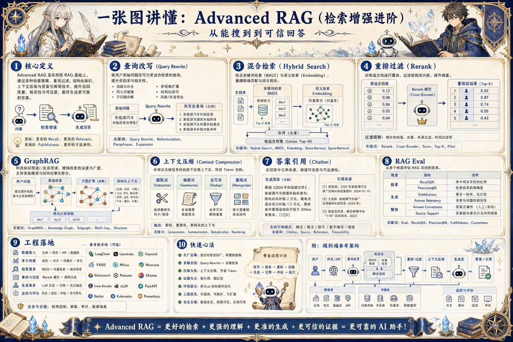

# Advanced RAG 进阶检索地图：从能搜到到可信回答

> Advanced RAG 通过查询改写、混合检索、重排、权限过滤、GraphRAG、评测和反馈回流提升答案可信度。

## 一句话

RAG 进阶的关键，是让召回、排序、上下文和引用都围绕同一个可验证问题收敛。

## 标准流程

1. 理解问题
2. 查询改写
3. 多路召回
4. 重排过滤
5. 上下文压缩
6. 生成引用
7. 答案评测
8. 反馈回流

## 知识拆解

### 核心定义

- Advanced RAG 是对基础 RAG 的工程增强
- 它优化问题理解、召回质量、证据排序和答案验证
- 适合企业知识库、客服、投研和运营分析
- 目标是提高可追溯、可更新和可控性

### 查询改写

- 把口语问题改写成适合检索的查询
- 补充同义词、缩写和领域术语
- 多轮对话要合并历史指代
- 改写结果必须保留原始意图和限制条件

### 混合检索

- 关键词检索适合精确实体和术语
- 向量检索适合语义相近内容
- Hybrid Search 合并两类候选
- 按任务类型调整 BM25 与向量权重

### 重排过滤

- Rerank 用更强模型重新判断相关性
- 过滤过期、越权、重复和低质量片段
- 同源文档可合并上下文避免碎片化
- 高风险回答只使用可信等级足够的来源

### GraphRAG

- 把实体、关系和社区摘要纳入检索
- 适合跨文档关系和复杂问答
- 图谱构建需要实体消歧和关系质量控制
- 图检索结果仍要回到证据片段验证

### 上下文压缩

- 把长证据压缩成与问题相关的要点
- 保留来源、时间、实体和关键数字
- 按结论组织证据，而非按检索顺序堆放
- 压缩过程也需要防止遗漏反证

### 答案引用

- 关键结论绑定文档、段落或记录 ID
- 引用不足时输出不确定或请求补充
- 引用和答案要做一致性校验
- 用户应能点回证据来源

### RAG Eval

- 评估问题理解、召回、重排、生成和引用
- 指标包括 Recall@K、Faithfulness、Citation Accuracy
- 构造困难问题、过期知识和权限边界样本
- 线上失败样本进入离线回归

### 工程落地

- 知识库增量更新和索引版本管理
- 检索参数、Prompt 和模型版本一起记录
- 为不同场景配置不同检索策略
- 把用户反馈转成数据修复和评测样本

## 实践检查清单

- 查询改写不能改变用户意图
- 混合检索要同时看语义和关键词证据
- Rerank 后仍需权限、时效和去重过滤
- 引用必须能支持关键结论
- 线上未命中问题要回流到知识库和评测集

## 维护说明

本文由 `content/notes/ai-knowledge-topics.json` 的结构化内容生成。
如果需要调整正文或海报文字，请先修改数据源，再运行 `python3 scripts/build_knowledge_posters.py`。
如果只想更新单个主题，可以在命令后追加 slug，例如 `python3 scripts/build_knowledge_posters.py agent-harness`。
脚本默认不会覆盖已存在的海报；如需生成程序化草稿图，请显式追加 `--overwrite-posters`。
