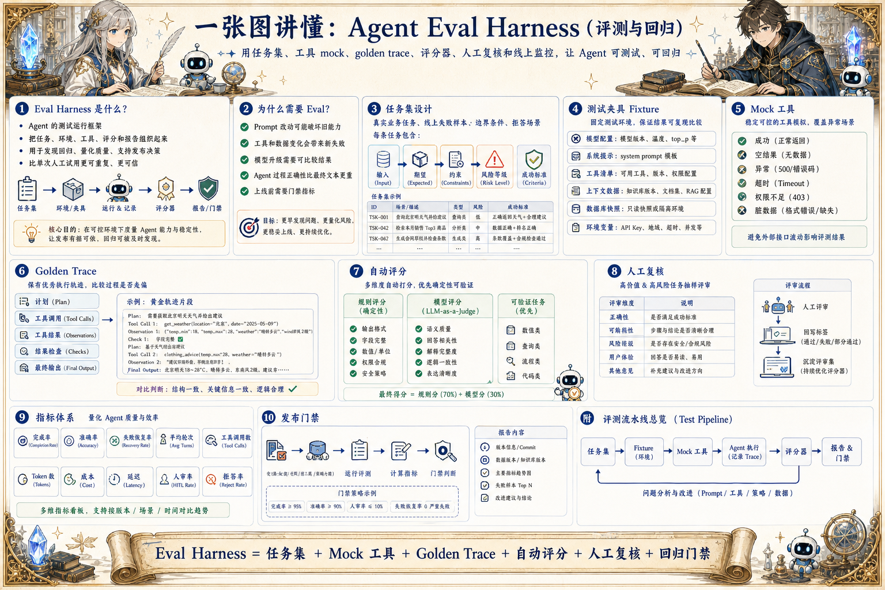

# Agent Eval Harness 评测地图：让智能体可测试、可回归

> 用任务集、工具 mock、golden trace、评分器、人工复核和线上监控，判断 Agent 是否稳定完成真实任务。

## 一句话

没有 Eval Harness 的 Agent，只是在演示里看起来聪明；有了回归评测，才知道它是否真的稳定。

## 标准流程

1. 定义任务集
2. 准备夹具
3. Mock 工具
4. 运行 Agent
5. 记录 Trace
6. 自动评分
7. 人工复核
8. 回归发布

## 知识拆解

### 核心定义

- Eval Harness 是 Agent 的测试运行框架
- 它把任务、环境、工具、评分和报告组织起来
- 目标是发现回归、量化质量和支持发布决策
- 比单次人工试用更可重复、更可信

### 任务集设计

- 从真实用户任务和线上失败样本收集用例
- 覆盖简单、复杂、边界和拒答场景
- 每条任务写清输入、期望、约束和风险等级
- 定期加入新样本避免只适配旧题

### 测试夹具

- 固定模型参数、系统提示、工具清单和上下文
- 准备稳定的数据库快照或文件样本
- 用环境变量隔离测试和生产资源
- 保证同一版本可以重复运行

### 工具 Mock

- 模拟工具成功、空结果、异常、超时和权限不足
- 避免评测依赖真实外部接口波动
- 记录 Agent 对工具失败的恢复行为
- 关键工具可以同时做 mock 和真实回放

### Golden Trace

- 保存优秀执行过程作为参考轨迹
- 包含计划、工具调用、结果检查和最终输出
- 用于判断新版本是否走偏
- 不要只比较最终文本，还要比较过程正确性

### 自动评分

- 规则评分适合格式、字段、数值和权限
- 模型评分适合语义质量和解释完整度
- 工具结果可验证任务优先使用确定性评分
- 评分器本身也要抽样校验

### 人工复核

- 高价值或高风险任务保留人工评审
- 评审维度包括正确性、可解释性、风险和体验
- 人工意见写回任务标签和失败类型
- 用少量精评样本校准自动评分器

### 指标体系

- 完成率、准确率、失败恢复率
- 平均轮次、工具调用数、token、成本和延迟
- 人审率、拒答率、越权拦截率
- 按任务类型和版本追踪趋势

### 发布门禁

- Prompt、模型、工具和策略变更都要触发回归
- 核心任务低于阈值时阻止发布
- 评测报告要关联 commit、配置和数据版本
- 线上失败样本回流到下一轮评测集

## 实践检查清单

- 评测任务要来自真实业务，而不是只考玩具问题
- 工具 mock 要覆盖成功、失败、超时和脏数据
- 评分指标必须包含结果质量、过程正确和成本延迟
- 高风险任务要保留人工评审样本
- 每次 Prompt、模型、工具或策略变化都要跑回归

## 维护说明

本文由 `content/notes/ai-knowledge-topics.json` 的结构化内容生成。
如果需要调整正文或海报文字，请先修改数据源，再运行 `python3 scripts/build_knowledge_posters.py`。
如果只想更新单个主题，可以在命令后追加 slug，例如 `python3 scripts/build_knowledge_posters.py agent-harness`。
脚本默认不会覆盖已存在的海报；如需生成程序化草稿图，请显式追加 `--overwrite-posters`。
