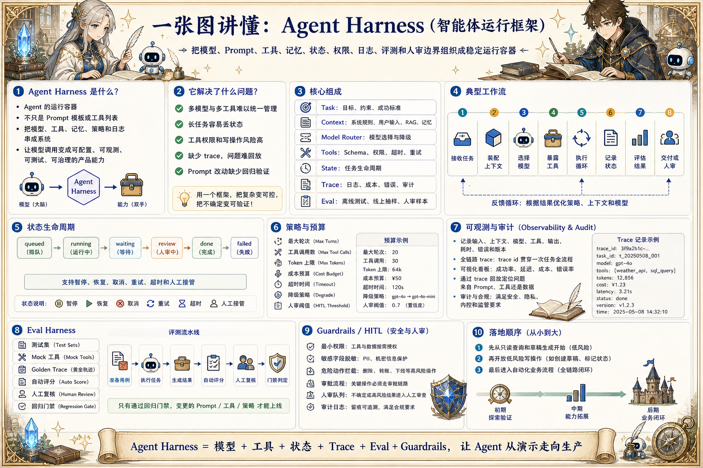

# Agent Harness 工程地图：把模型包成可运行系统

> Harness 把模型、Prompt、工具、记忆、状态、权限、日志、评测和人审边界组织成稳定运行容器。

## 一句话

Agent Harness 的价值，是把一次模型调用变成可配置、可观测、可测试、可治理的运行系统。

## 标准流程

1. 接收任务
2. 装配上下文
3. 选择模型
4. 暴露工具
5. 执行循环
6. 记录状态
7. 评估结果
8. 交付或人审

## 知识拆解

### 核心定义

- Harness 是 Agent 的运行容器
- 它不等于 Prompt 模板或工具列表
- 负责把模型、工具、记忆、策略和日志串成系统
- 决定 Agent 能否稳定进入生产流程

### 任务建模

- 把用户请求转成任务对象
- 记录目标、约束、上下文来源和成功标准
- 区分一次性问答、长任务和写操作
- 缺少关键信息时先澄清而不是硬跑

### 上下文装配

- 按任务类型选择系统规则、用户输入、RAG、记忆和工具结果
- 控制 token 预算和信息优先级
- 保留来源、时间和权限信息
- 把上下文拼装过程记录为可回放快照

### 能力注册

- 工具以 schema、权限、超时和失败策略注册
- 只暴露当前任务需要的最小能力
- 读工具、写工具和危险工具分层管理
- 工具结果统一进入运行状态和 trace

### 状态生命周期

- 任务状态包含 queued、running、waiting、review、done、failed
- 每一步产物、错误和决策都写入状态
- 长任务支持暂停、恢复、取消和重试
- 状态机让 Agent 不会在对话里丢进度

### 策略与预算

- 设置最大轮次、最大工具调用、token 和成本预算
- 定义停止条件、降级条件和人工接管条件
- 失败重试要有次数和退避策略
- 不同风险等级使用不同运行策略

### 可观测审计

- 记录输入、上下文、模型、工具、输出和耗时
- 把 trace 与用户、任务、版本关联
- 敏感字段脱敏后再展示或存储
- 通过回放定位错误来自 Prompt、工具还是数据

### 评测回归

- Harness 应支持离线测试和线上抽样
- 用 mock 工具复现边界条件
- 保存 golden trace 防止回归
- 指标覆盖完成率、成本、延迟和人审率

### 产品化落地

- 将 Harness 封装成可复用 SDK 或服务
- 为不同业务配置不同工具包和策略
- 给运营人员暴露任务视图和人审入口
- 先从低风险只读场景逐步扩展

## 实践检查清单

- Harness 必须明确模型能看什么、能调用什么、能写什么
- 工具、记忆、上下文和权限都要通过统一运行边界管理
- 每次执行都要产生 trace，便于回放、调试和评估
- 长任务需要状态、预算、超时、取消和恢复机制
- 高风险动作必须有策略拦截、人审或沙盒

## 维护说明

本文由 `content/notes/ai-knowledge-topics.json` 的结构化内容生成。
如果需要调整正文或海报文字，请先修改数据源，再运行 `python3 scripts/build_knowledge_posters.py`。
如果只想更新单个主题，可以在命令后追加 slug，例如 `python3 scripts/build_knowledge_posters.py agent-harness`。
脚本默认不会覆盖已存在的海报；如需生成程序化草稿图，请显式追加 `--overwrite-posters`。
