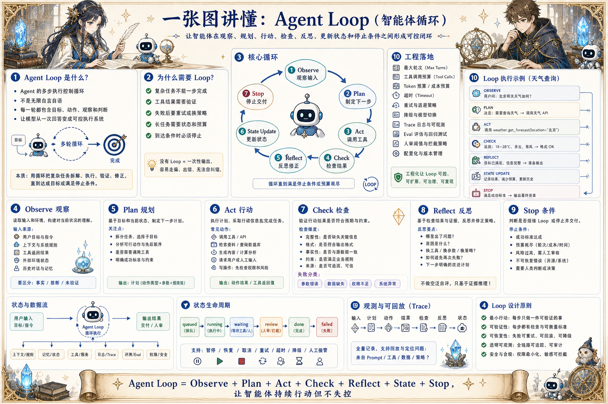

# Agent Loop 执行地图：让智能体循环行动而不失控

> 把观察、计划、行动、检查、反思、状态更新和停止条件拆开，形成可控的 Agent 执行闭环。

## 一句话

好的 Agent Loop 不是无限自言自语，而是在每一步都知道为什么继续、何时停止、失败如何处理。

## 标准流程

1. 观察输入
2. 理解目标
3. 制定下一步
4. 调用工具
5. 检查结果
6. 更新状态
7. 反思修正
8. 停止交付

## 知识拆解

### 核心定义

- Agent Loop 是智能体重复执行任务的控制循环
- 典型结构包含 Observe、Plan、Act、Check、Reflect、Stop
- 它让模型从一次回答变成多步执行
- 循环越长，越需要状态、预算和边界

### Observe 观察

- 读取用户目标、上下文、工具结果和环境状态
- 区分原始输入、已验证事实和模型推断
- 为每轮循环准备最小必要信息
- 观察阶段不应擅自修改外部系统

### Plan 规划

- 决定下一步最有价值的动作
- 把复杂目标拆成可执行小步
- 评估工具是否必要、成本是否合理
- 计划要能被后续检查，不只是思维文本

### Act 行动

- 调用工具、生成内容、检索资料或请求人类输入
- 行动前确认权限、参数和风险等级
- 写操作需要幂等、确认和回滚策略
- 行动结果必须回写到状态

### Check 检查

- 验证工具结果是否完整、可信、符合目标
- 检查格式、事实、约束和边界条件
- 对失败结果分类：参数错、数据缺、权限不足或系统异常
- 必要时触发重试、降级或人审

### Reflect 反思

- 基于证据判断当前路径是否有效
- 总结失败原因并调整下一步策略
- 反思要短、具体、可执行
- 不能用空泛自我评价代替真实校验

### 状态更新

- 记录已完成步骤、未决问题和中间产物
- 保存关键事实、工具结果和决策依据
- 长任务要支持恢复和断点继续
- 状态摘要帮助下一轮减少上下文噪声

### 停止条件

- 达到成功标准时停止并交付
- 超过预算、轮次、时间或风险阈值时停止
- 遇到不可恢复错误时停止并解释原因
- 需要人类判断时转入等待或审批状态

### 工程模式

- 简单任务使用短循环或单步工具调用
- 复杂任务使用计划执行和阶段检查
- 高风险任务加入人审和沙盒
- 用 trace 和 eval 判断循环是否真的提升质量

## 实践检查清单

- 每轮循环都要有目标、动作、观察和判断
- 停止条件必须显式设计，不能让模型无限尝试
- 工具调用后必须检查结果，而不是直接相信
- 反思应基于证据和状态，不是泛泛自我批评
- 循环日志要能解释每一步为什么发生

## 维护说明

本文由 `content/notes/ai-knowledge-topics.json` 的结构化内容生成。
如果需要调整正文或海报文字，请先修改数据源，再运行 `python3 scripts/build_knowledge_posters.py`。
如果只想更新单个主题，可以在命令后追加 slug，例如 `python3 scripts/build_knowledge_posters.py agent-harness`。
脚本默认不会覆盖已存在的海报；如需生成程序化草稿图，请显式追加 `--overwrite-posters`。
