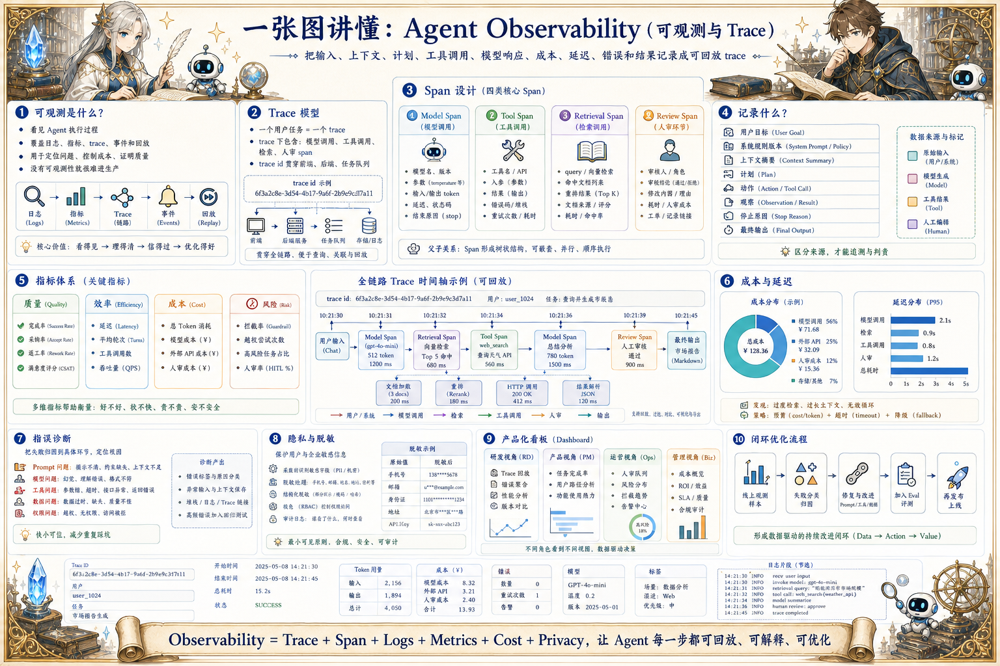

# Agent Observability 可观测地图：看见每一步为什么发生

> 把输入、上下文、计划、工具调用、模型响应、成本、延迟、错误和结果记录成可回放 trace。

## 一句话

Agent 可观测性的核心，是让一次看似神秘的智能行为，拆回可追踪、可解释、可改进的工程事件。

## 标准流程

1. 接收请求
2. 创建 Trace
3. 记录上下文
4. 记录模型调用
5. 记录工具调用
6. 汇总指标
7. 捕获异常
8. 回放优化

## 知识拆解

### 核心定义

- 可观测性让团队看见 Agent 执行过程
- 它覆盖日志、指标、trace、事件和回放
- 目标是定位问题、控制成本、证明质量
- 没有可观测性就很难把 Agent 放进生产

### Trace 模型

- 一个用户任务对应一个 trace
- trace 下包含模型调用、工具调用、检索和人审 span
- 每个 span 记录输入、输出、状态和耗时
- trace id 要贯穿前端、后端和任务队列

### Span 设计

- 模型 span 记录模型名、参数、token 和响应状态
- 工具 span 记录工具名、参数、结果和错误码
- 检索 span 记录 query、命中文档和重排结果
- 人审 span 记录审核人、结论和修改理由

### 日志内容

- 记录用户目标、系统规则版本和上下文摘要
- 保存计划、动作、观察和停止原因
- 关键决策要写清依据
- 日志应区分原始数据、模型生成和人工编辑

### 指标体系

- 质量指标：完成率、采纳率、返工率
- 效率指标：延迟、轮次、工具调用数
- 成本指标：token、模型成本、外部 API 成本
- 风险指标：拦截率、越权尝试、人审率

### 成本延迟

- 按模型、任务类型和工具拆分成本
- 发现过度检索、过长上下文和无效循环
- 为不同场景设置预算和超时
- 让产品可以在质量、速度和成本之间取舍

### 错误诊断

- 把失败归因到 Prompt、模型、工具、数据或权限
- 保存异常输入和失败上下文
- 支持按错误类型、版本和用户路径聚合
- 高频错误进入修复和回归测试

### 隐私脱敏

- 日志采集前识别敏感字段
- 展示层默认隐藏密钥、手机号、邮箱和业务敏感值
- 按角色控制 trace 查看权限
- 支持数据保留周期和删除请求

### 产品化看板

- 为研发展示 trace 回放和错误聚合
- 为产品展示任务完成率和用户路径
- 为运营展示待人审任务和风险分布
- 把线上观测样本自动沉淀到评测集

## 实践检查清单

- 每次 Agent 执行都要有唯一 trace id
- 上下文、工具调用和输出要能串成时间线
- 成本、延迟、错误和人审结果必须结构化记录
- 敏感信息先脱敏再展示或长期存储
- 可观测数据要能回流到 eval 和产品优化

## 维护说明

本文由 `content/notes/ai-knowledge-topics.json` 的结构化内容生成。
如果需要调整正文或海报文字，请先修改数据源，再运行 `python3 scripts/build_knowledge_posters.py`。
如果只想更新单个主题，可以在命令后追加 slug，例如 `python3 scripts/build_knowledge_posters.py agent-harness`。
脚本默认不会覆盖已存在的海报；如需生成程序化草稿图，请显式追加 `--overwrite-posters`。
