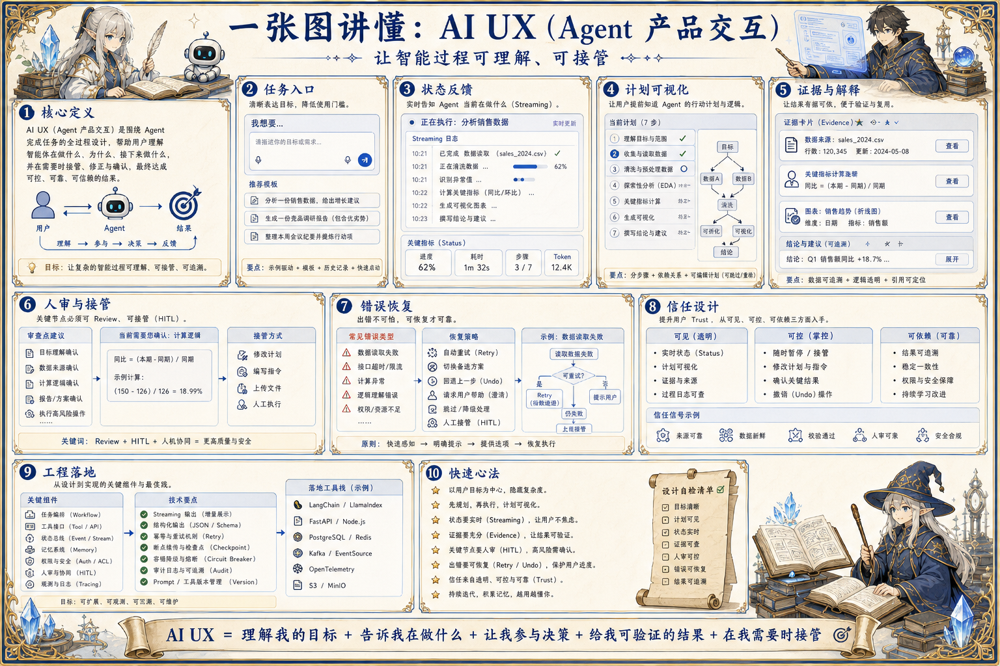

# AI UX 产品体验地图：让智能过程可理解、可接管

> AI UX 通过状态展示、流式反馈、证据引用、人审入口、重试与撤销，让用户理解 Agent 正在做什么并保持控制感。

## 一句话

好的 AI UX 不是让模型显得神奇，而是让用户知道发生了什么、能改变什么、该信任什么。

## 标准流程

1. 接收目标
2. 展示计划
3. 流式执行
4. 呈现证据
5. 请求确认
6. 允许接管
7. 交付结果
8. 收集反馈

## 知识拆解

### 核心定义

- AI UX 是围绕不确定智能行为设计交互
- 它让用户理解系统状态、证据和边界
- 目标是建立信任而不是制造魔法感
- 适合 Agent、Copilot、分析助手和运营工作台

### 任务入口

- 入口要明确用户目标和输入要求
- 复杂任务提供模板、示例和约束选择
- 高风险任务先说明权限和影响范围
- 不要让用户一次性猜完所有参数

### 状态反馈

- 展示排队、检索、分析、工具调用和审核状态
- 长任务需要进度、日志和预计下一步
- 流式输出要区分草稿、证据和最终结果
- 异常状态要可定位、可重试

### 计划可视化

- Agent 执行前展示任务拆解和工具计划
- 用户可以删除、调整或锁定步骤
- 计划变更要说明原因
- 关键节点加入人工确认

### 证据与解释

- 重要结论绑定来源、数据和时间
- 把模型推断和事实证据区分展示
- 允许用户展开查看原始材料
- 不确定性要以业务语言表达

### 人审与接管

- 高风险写入、付款、发布和删除进入审批
- 用户可暂停、恢复、取消和重跑任务
- 人工修改应写回任务状态和 trace
- 接管入口要明显且不打断低风险流程

### 错误恢复

- 失败要说明是缺数据、权限、工具还是模型问题
- 提供补充信息、重试、换路径或转人工
- 保留失败前的中间产物
- 重复失败要降低自动化等级

### 信任设计

- 区分建议、草稿和正式提交
- 展示成本、权限和影响范围
- 避免过度拟人化掩盖系统边界
- 让用户看到系统为何拒绝或等待

### 工程落地

- 前端状态与后端任务状态机保持一致
- 任务 trace、工具结果和人审记录可回放
- UI 组件复用在项目中心和案例页
- 用完成率、人审率、重试率评估体验

## 实践检查清单

- 用户必须看见当前阶段、下一步和风险点
- 高风险写操作需要确认和撤销路径
- 模型不确定时要显式表达原因
- 证据、日志和中间产物要能展开查看
- 失败状态要给出可执行下一步

## 维护说明

本文由 `content/notes/ai-knowledge-topics.json` 的结构化内容生成。
如果需要调整正文或海报文字，请先修改数据源，再运行 `python3 scripts/build_knowledge_posters.py`。
如果只想更新单个主题，可以在命令后追加 slug，例如 `python3 scripts/build_knowledge_posters.py agent-harness`。
脚本默认不会覆盖已存在的海报；如需生成程序化草稿图，请显式追加 `--overwrite-posters`。
