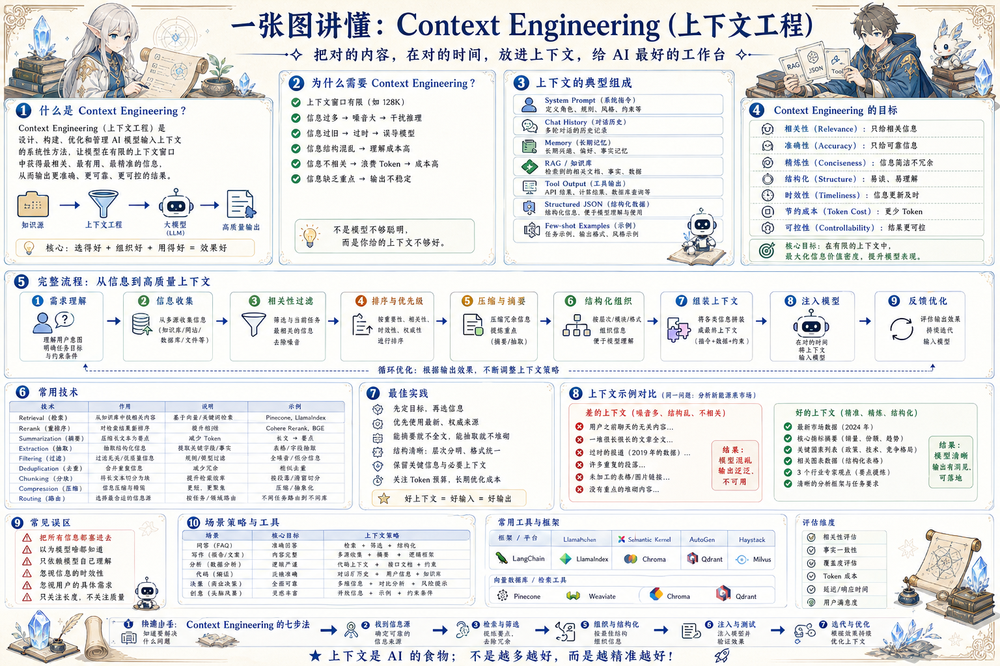

# Context Engineering 工作台：把正确材料放到正确位置

> 设计、组织、压缩和注入上下文，让模型在有限窗口内拿到最相关、最可信、最可操作的信息。

## 一句话

上下文不是越多越好，而是越相关、越结构化、越可验证越好。

## 标准流程

1. 理解任务
2. 收集信息
3. 筛选相关
4. 压缩摘要
5. 结构组织
6. 注入模型
7. 验证输出
8. 反馈优化

## 知识拆解

### 核心定义

- 上下文工程是设计模型输入工作台
- 目标是提供足够但不过量的信息
- 它同时处理事实、规则、记忆、工具结果和格式
- 决定模型能否稳定完成真实任务

### 任务意图

- 识别用户要决策、生成、检索还是执行
- 明确输出格式、质量标准和禁止事项
- 把隐藏假设显式写入上下文
- 对模糊目标先澄清或列出可选解释

### 信息来源

- 系统规则定义不可违反边界
- 用户输入提供本轮目标和偏好
- 知识库提供外部事实和文档
- 工具输出提供实时状态和计算结果

### 记忆与偏好

- 短期记忆保留当前任务状态
- 长期记忆保留稳定偏好和历史事实
- 记忆要能更新、撤销和过期
- 不能把敏感记忆无条件注入每次请求

### 筛选与压缩

- 先按相关性和可信度过滤
- 再摘要掉冗余、重复和低价值内容
- 保留数字、边界条件、来源和异常
- 压缩不能改变原始事实含义

### 结构化组织

- 用标题、列表、表格和 JSON 让模型定位信息
- 把背景、任务、约束、证据和输出格式分区
- 重要规则放在靠前且明确的位置
- 示例要和当前任务同类型

### 工具输出注入

- 工具结果必须标出时间、参数和来源
- 失败、空结果和部分结果不能隐藏
- 数值类结果尽量保留原始字段
- 写操作结果要记录 job、trace 和状态

### 评估与调试

- 看失败是缺信息、信息错、结构差还是模型能力不足
- 比较不同上下文策略的完成率和成本
- 记录触发幻觉的输入模式
- 建立可回放的 prompt/context 快照

### 工程落地

- 把上下文拼装做成可测试模块
- 按任务类型定义 Context Pack
- 关键规则版本化，避免隐式漂移
- 为 Agent 暴露最小必要上下文接口

## 实践检查清单

- 先判断任务需要事实、规则、示例还是工具结果
- 上下文按优先级组织，不能把噪声平均塞入
- 每段关键材料保留来源和可信度
- 长上下文要压缩、分层和按需检索
- 输出失败后回看上下文，而不是只改 Prompt

## 维护说明

本文由 `content/notes/ai-knowledge-topics.json` 的结构化内容生成。
如果需要调整正文或海报文字，请先修改数据源，再运行 `python3 scripts/build_knowledge_posters.py`。
