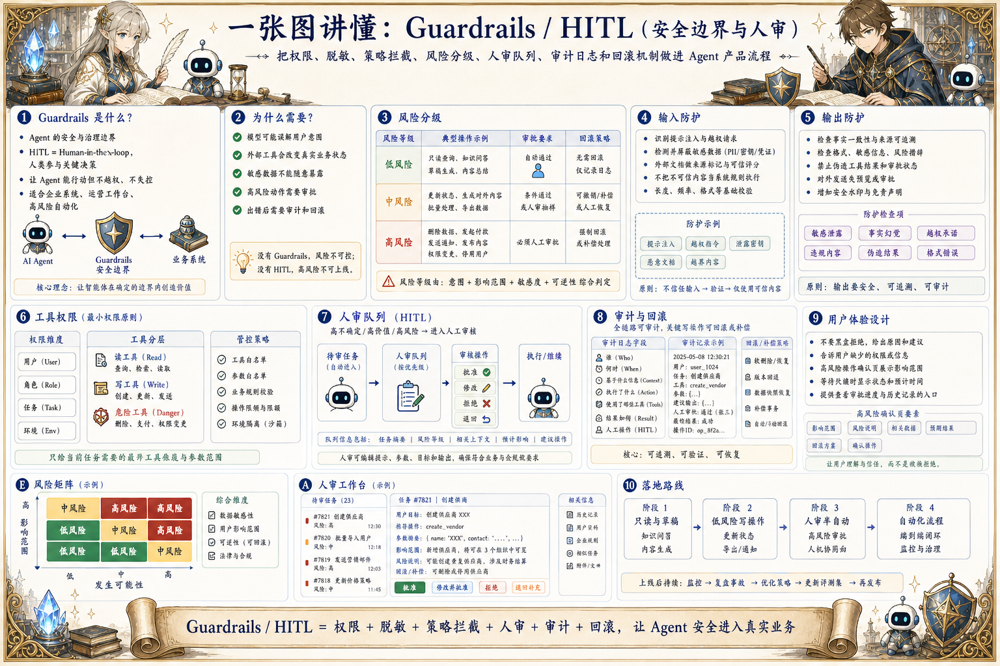

# Guardrails 与 HITL 地图：把安全边界和人审做进产品

> 通过权限、脱敏、策略拦截、风险分级、人审队列、审计日志和回滚机制，让 Agent 在业务系统中安全行动。

## 一句话

Guardrails 不是给 Agent 套一层口号，而是把权限、风险、人审和审计嵌进每一次真实行动。

## 标准流程

1. 识别风险
2. 权限检查
3. 输入输出过滤
4. 策略拦截
5. 人审分流
6. 执行或拒绝
7. 记录审计
8. 反馈优化

## 知识拆解

### 核心定义

- Guardrails 是 Agent 的安全与治理边界
- HITL 是 Human-in-the-loop，人类参与关键决策
- 目标是让 Agent 能行动但不越权、不失控
- 适合企业系统、运营工作台和高风险自动化

### 风险分级

- 低风险：只读查询和草稿生成
- 中风险：更新状态、生成对外内容、批量处理
- 高风险：删除、付款、发送、发布和权限变更
- 不同等级对应不同审批和回滚策略

### 输入防护

- 识别提示注入、越权请求和敏感数据
- 对外部文档、网页和用户上传内容做来源标记
- 限制模型把不可信内容当系统规则
- 缺少授权时拒绝访问对应资源

### 输出防护

- 检查事实、格式、敏感信息和风险措辞
- 对外发送内容先进入预览或审批
- 高风险输出需要引用来源和决策依据
- 禁止模型伪造工具结果或审批状态

### 工具权限

- 按用户、角色、任务和环境裁剪工具能力
- 读工具、写工具和危险工具分层暴露
- 工具参数需要白名单、范围和业务规则校验
- 生产写操作需要幂等、审计和回滚

### 人审队列

- 把不确定、高价值或高风险任务分流给人类
- 审核界面要显示目标、上下文、模型建议和风险点
- 人类可以批准、修改、拒绝或退回补充信息
- 审核结果回写为训练、规则和评测样本

### 审计回滚

- 记录谁在什么时间基于什么信息做了什么
- 保留模型建议、工具参数、人工修改和最终结果
- 关键写操作要能撤销或补偿
- 审计日志支持问题追责和合规检查

### 用户体验

- 不要把安全流程做成黑盒拒绝
- 告诉用户缺少什么权限或信息
- 高风险操作用确认界面展示影响范围
- 在人审等待时给出状态、预计时间和下一步

### 落地策略

- 从只读、草稿和辅助决策开始上线
- 逐步开放低风险写操作
- 用线上观测调整风险阈值
- 把安全规则、评测和事故复盘持续更新

## 实践检查清单

- 先按业务风险分级，再决定哪些动作能自动化
- 读、写、删除、发送、支付等能力必须分权限
- 用户和内部数据要有脱敏、留存和删除机制
- 人审节点要有明确 SLA、上下文和可操作决策
- 每一次拦截、放行和人工修改都要进入审计

## 维护说明

本文由 `content/notes/ai-knowledge-topics.json` 的结构化内容生成。
如果需要调整正文或海报文字，请先修改数据源，再运行 `python3 scripts/build_knowledge_posters.py`。
如果只想更新单个主题，可以在命令后追加 slug，例如 `python3 scripts/build_knowledge_posters.py agent-harness`。
脚本默认不会覆盖已存在的海报；如需生成程序化草稿图，请显式追加 `--overwrite-posters`。
