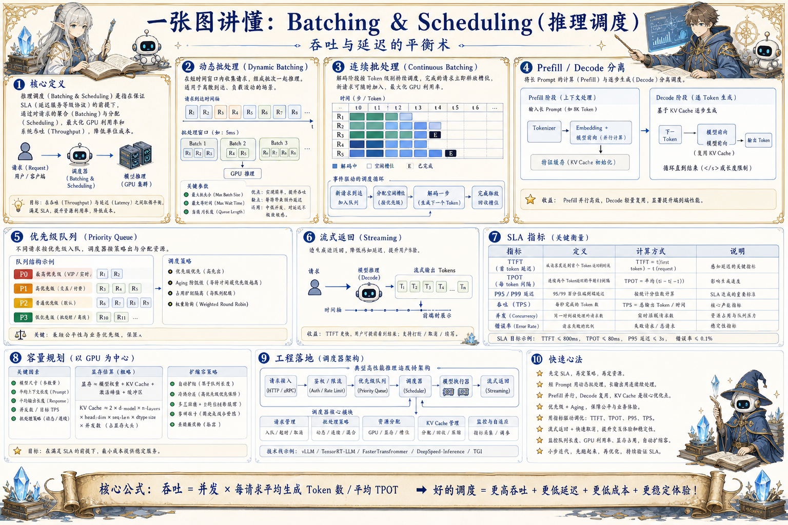

# Batching & Scheduling 推理调度地图：吞吐与延迟的平衡术

> 推理调度通过动态批处理、连续批处理、优先级队列、Prefill/Decode 分离和限流，在吞吐、延迟和成本之间取平衡。

## 一句话

推理调度不是把请求攒成一批那么简单，而是在用户等待和 GPU 吃饱之间持续做选择。

## 标准流程

1. 接收请求
2. 分类排队
3. 动态组批
4. Prefill 调度
5. Decode 轮转
6. 返回流式
7. 释放资源
8. 容量调优

## 知识拆解

### 核心定义

- Batching 把多个请求合并利用 GPU 并行
- Scheduling 决定请求何时进入计算和如何轮转
- 目标是在吞吐、延迟、成本间平衡
- 在线服务更关注尾延迟和稳定性

### 动态批处理

- 在短时间窗口内收集请求组成 batch
- 提升 GPU 利用率和 tokens/s
- 等待窗口过大会增加首 token 延迟
- 需要按模型、长度和优先级分桶

### 连续批处理

- Decode 阶段不断插入新请求和移除完成请求
- 避免整个 batch 等最慢请求
- 适合生成长度差异大的在线服务
- 需要复杂 KV Cache 和调度管理

### Prefill/Decode

- Prefill 计算密集，Decode 更受显存带宽影响
- 两类阶段混跑可能互相阻塞
- 分离实例或队列能改善尾延迟
- 长 prompt 应进入特殊调度策略

### 优先级队列

- 交互请求优先于后台批处理
- 付费等级、业务重要性和超时时间影响优先级
- 低优先级任务可延迟、降级或取消
- 避免高优先级流量饿死普通请求

### 流式返回

- 流式能降低感知延迟
- 前端要区分首 token 和完整完成
- 中断生成要释放资源
- 部分结果也要纳入 trace 和计费

### SLA 指标

- TTFT、TPOT、P95/P99、tokens/s
- 请求成功率、超时率、队列等待时间
- GPU 利用率、显存占用和 batch size
- 成本指标按模型和业务聚合

### 容量规划

- 根据峰值并发、平均输入输出长度估算实例
- 区分日常、活动和后台任务容量
- 自动扩缩容要考虑模型加载时间
- 冷启动和模型切换可能成为瓶颈

### 工程落地

- 先定义业务 SLA，再选择调度策略
- 压测覆盖短、中、长上下文混合流量
- 监控队列和 GPU 双侧指标
- 将降级、排队提示和重试反馈给用户

## 实践检查清单

- 离线吞吐和在线延迟目标要分开设计
- 短请求和长请求混跑会制造尾延迟
- batch 太大提升吞吐但伤害交互体验
- 优先级、限流和超时要与业务 SLA 绑定
- 调度策略必须通过压测和线上指标验证

## 维护说明

本文由 `content/notes/ai-knowledge-topics.json` 的结构化内容生成。
如果需要调整正文或海报文字，请先修改数据源，再运行 `python3 scripts/build_knowledge_posters.py`。
如果只想更新单个主题，可以在命令后追加 slug，例如 `python3 scripts/build_knowledge_posters.py agent-harness`。
脚本默认不会覆盖已存在的海报；如需生成程序化草稿图，请显式追加 `--overwrite-posters`。
