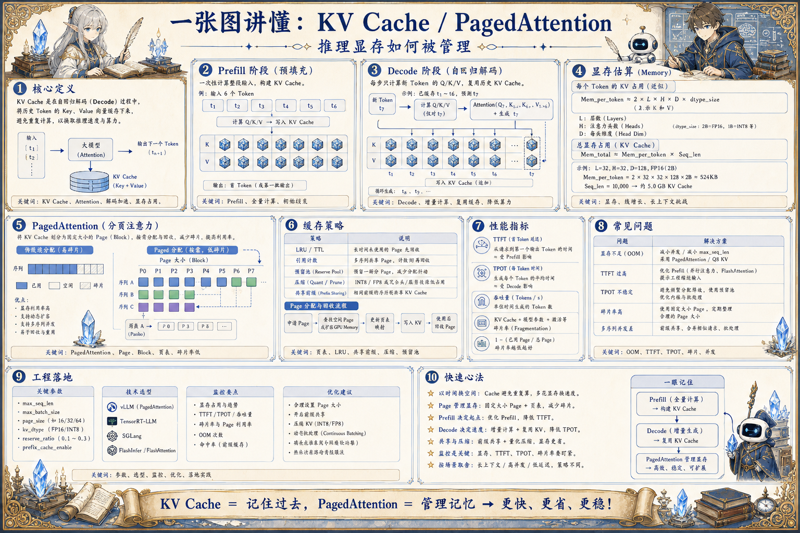

# KV Cache 与 PagedAttention 地图：推理显存如何被管理

> KV Cache 保存注意力历史，PagedAttention 用分页方式管理显存碎片，让长上下文和高并发推理更高效。

## 一句话

KV Cache 让模型不用重复看完整历史，但它也把推理性能问题变成了显存管理问题。

## 标准流程

1. 输入 Prompt
2. Prefill 计算
3. 写入 KV
4. Decode 生成
5. 读取缓存
6. 分页调度
7. 释放显存
8. 监控优化

## 知识拆解

### 核心定义

- KV Cache 保存每层注意力的 Key 和 Value
- Decode 阶段复用历史缓存减少重复计算
- 它显著加速自回归生成
- 但会随 batch、层数和上下文长度占用显存

### Prefill 阶段

- Prefill 一次性处理输入 prompt
- 计算量随输入长度增长
- 主要瓶颈常在矩阵计算和注意力
- 长 prompt 会推高首 token 延迟

### Decode 阶段

- Decode 每次生成一个或少量 token
- 需要读取已有 KV Cache
- 单步计算小但重复次数多
- 吞吐受显存带宽、调度和 batch 影响

### 显存估算

- KV 大小与层数、头数、head dim、上下文和 batch 相关
- 精度从 FP16 降到 INT8 可降低缓存占用
- 多并发长对话会快速吃满显存
- 估算显存是部署容量规划基础

### PagedAttention

- 把 KV Cache 切成固定大小 block
- 像操作系统分页一样分配和回收显存
- 减少连续内存要求和碎片浪费
- 支持更灵活的 batch 和长序列调度

### 缓存策略

- 请求结束后释放 block
- 共享前缀可复用部分缓存
- 长会话可能需要截断或压缩
- 低优先级请求可被抢占或迁移

### 性能指标

- TTFT 衡量首 token 延迟
- TPOT 衡量每 token 生成时间
- 吞吐看 tokens/s 和 requests/s
- 还要监控显存利用率和 cache 命中

### 常见问题

- KV 爆显存导致并发下降
- Prefill 堵塞 Decode 增加尾延迟
- 长上下文请求拖慢短请求
- 缓存碎片让可用显存低于预期

### 工程落地

- 按请求长度分队列或分实例
- 结合 continuous batching 和优先级调度
- 为长上下文配置单独配额
- 压测不同上下文长度下的显存和延迟

## 实践检查清单

- 上下文越长，KV Cache 显存压力越明显
- Prefill 和 Decode 的瓶颈不同，不能混为一谈
- 分页管理能减少碎片并提升并发
- 缓存释放、复用和抢占策略影响尾延迟
- 推理监控要区分 token、请求和显存维度

## 维护说明

本文由 `content/notes/ai-knowledge-topics.json` 的结构化内容生成。
如果需要调整正文或海报文字，请先修改数据源，再运行 `python3 scripts/build_knowledge_posters.py`。
如果只想更新单个主题，可以在命令后追加 slug，例如 `python3 scripts/build_knowledge_posters.py agent-harness`。
脚本默认不会覆盖已存在的海报；如需生成程序化草稿图，请显式追加 `--overwrite-posters`。
