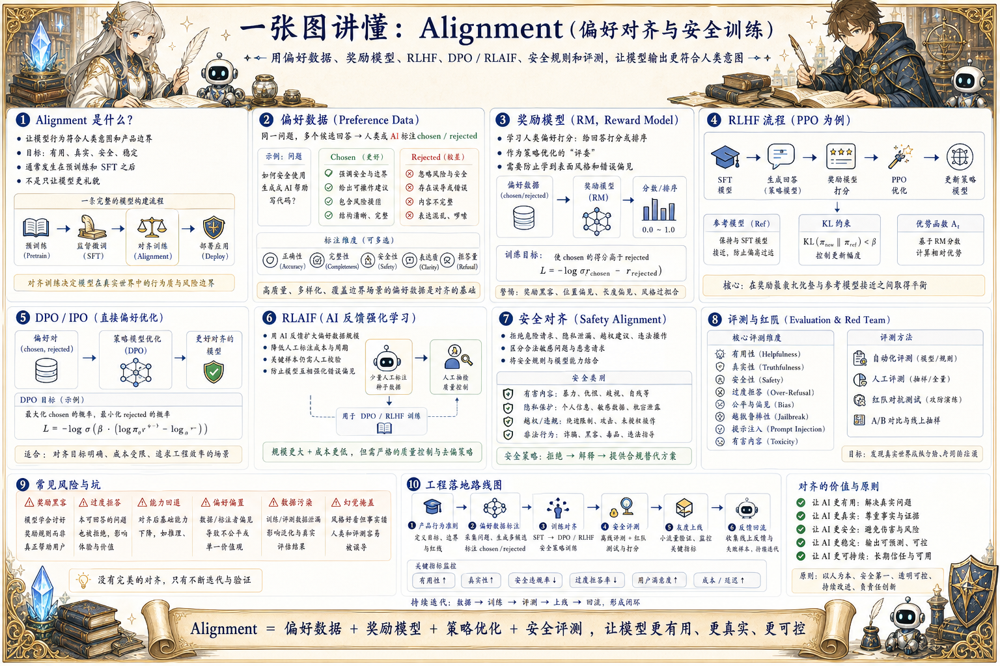

# Alignment 对齐地图：从偏好数据到更可靠的模型行为

> 对齐通过偏好数据、奖励模型、RLHF、DPO/RLAIF、安全规则和评测，让模型输出更符合人类意图和产品边界。

## 一句话

对齐不是让模型更会说好听话，而是让它在有用、真实、安全和可控之间做更稳定的取舍。

## 标准流程

1. 收集回答
2. 构造偏好
3. 训练奖励模型
4. 优化策略
5. 安全过滤
6. 人工评测
7. 红队测试
8. 发布监控

## 知识拆解

### 核心定义

- Alignment 让模型行为更符合人类意图和产品边界
- 常见方法包括 RLHF、DPO、RLAIF 和规则约束
- 目标不只是安全，也包括有用、真实、礼貌和稳定
- 对齐通常发生在预训练和 SFT 之后

### 偏好数据

- 同一问题生成多个候选回答
- 人工或模型标注哪个更好
- 标注维度包括正确性、完整性、安全性和表达
- 偏好数据质量直接决定对齐方向

### 奖励模型

- 奖励模型学习人类偏好打分
- 用于指导策略优化
- 可能学到表面风格而非真实质量
- 需要用 holdout 集和人工抽查校准

### RLHF

- 先训练奖励模型，再用强化学习优化模型输出
- PPO 是经典实现路线
- 能优化复杂偏好但训练成本高
- 需要约束模型不要偏离 SFT 太远

### DPO / IPO

- 直接用偏好对优化模型
- 不需要显式奖励模型和 RL 循环
- 工程实现相对简单稳定
- 仍需要高质量 chosen / rejected 数据

### RLAIF

- 使用 AI 反馈替代或辅助人类反馈
- 适合扩大偏好数据规模
- 需要防止模型互相强化错误偏见
- 关键样本仍应保留人工校验

### 安全对齐

- 训练拒绝危险请求和隐私泄漏
- 区分合法敏感问题与恶意请求
- 减少幻觉、越权建议和危险操作
- 安全规则要能解释和持续更新

### 评测红队

- 评测有用性、真实性、拒答质量和偏见
- 红队测试越狱、提示注入和危险内容
- 监控过度拒答和能力回退
- 线上样本进入下一轮对齐数据

### 工程落地

- 先建立清晰的产品行为准则
- 把偏好标注、训练、评测和发布串成流程
- 对齐模型仍要配合 Guardrails 和工具权限
- 持续用线上反馈修正奖励和策略

## 实践检查清单

- 偏好数据要覆盖有用性、真实性、安全性和风格
- 奖励模型可能被模型钻空子，必须持续评估
- DPO 更简单，但仍依赖高质量偏好对
- 对齐过度会造成过度拒答和能力下降
- 安全策略、评测和线上反馈要一起迭代

## 维护说明

本文由 `content/notes/ai-knowledge-topics.json` 的结构化内容生成。
如果需要调整正文或海报文字，请先修改数据源，再运行 `python3 scripts/build_knowledge_posters.py`。
如果只想更新单个主题，可以在命令后追加 slug，例如 `python3 scripts/build_knowledge_posters.py agent-harness`。
脚本默认不会覆盖已存在的海报；如需生成程序化草稿图，请显式追加 `--overwrite-posters`。
