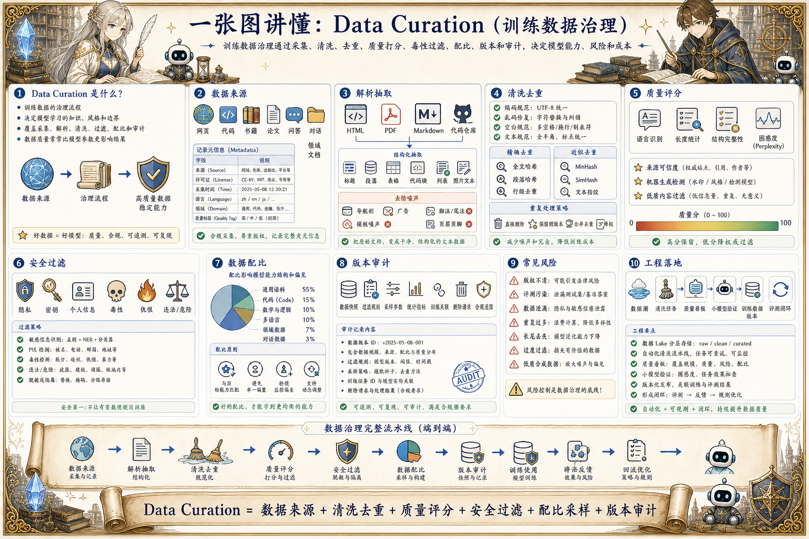

# LLM Data Curation 数据治理地图：模型能力从数据开始

> 训练数据治理通过采集、清洗、去重、质量打分、毒性过滤、配比、版本和审计，决定模型能力、风险和成本。

## 一句话

大模型能力不是凭空长出来的，数据治理决定它见过什么、忽略什么、学会什么、以及不能学什么。

## 标准流程

1. 采集数据
2. 解析抽取
3. 清洗规范
4. 去重过滤
5. 质量打分
6. 安全审查
7. 配比采样
8. 版本发布

## 知识拆解

### 核心定义

- Data Curation 是训练数据的治理流程
- 它决定模型学习的知识、风格和边界
- 覆盖采集、清洗、过滤、配比和审计
- 数据质量常常比模型参数更影响结果

### 数据来源

- 网页、代码、书籍、论文、问答、对话和领域文档
- 每类数据有不同噪声、版权和价值
- 来源要记录许可证、时间和处理方式
- 高质量领域数据需要独立管理

### 解析抽取

- 从 HTML、PDF、Markdown、代码仓库提取正文
- 保留标题、段落、表格和代码结构
- 去掉导航、广告、脚注和模板噪声
- 解析错误会直接变成训练噪声

### 清洗去重

- 规范编码、空白、乱码和重复段落
- 精确去重减少重复样本
- 近似去重减少模板化和复制内容
- 去重过度也可能损伤长尾知识

### 质量评分

- 按语言、长度、困惑度、结构和来源打分
- 过滤垃圾内容、机器生成低质文本和重复模板
- 高质量样本可提高采样权重
- 质量模型本身也需要校验

### 安全过滤

- 过滤隐私、密钥、个人信息和敏感数据
- 识别毒性、仇恨、违法和危险内容
- 保留必要安全训练样本但做隔离
- 所有过滤规则应版本化

### 数据配比

- 控制通用语料、代码、数学、多语言和领域数据比例
- 配比影响模型能力结构
- 小比例高质量数据可能收益很高
- 配比实验要结合评测结果迭代

### 版本审计

- 记录数据快照、过滤规则、采样参数和统计指标
- 训练任务关联数据版本
- 支持问题样本追踪和删除请求
- 审计是合规和复现实验的基础

### 工程落地

- 建立数据湖、清洗任务和质量看板
- 先用小模型验证数据收益
- 将线上失败样本回流为训练候选
- 数据治理要和评测、训练、发布闭环

## 实践检查清单

- 数据源、许可证和采集时间必须记录
- 去重既要做精确重复，也要做近似重复
- 低质量、毒性、隐私和版权风险要在入库前处理
- 数据配比会改变模型能力结构和偏见
- 每次训练都要能追溯到数据版本和过滤规则

## 维护说明

本文由 `content/notes/ai-knowledge-topics.json` 的结构化内容生成。
如果需要调整正文或海报文字，请先修改数据源，再运行 `python3 scripts/build_knowledge_posters.py`。
如果只想更新单个主题，可以在命令后追加 slug，例如 `python3 scripts/build_knowledge_posters.py agent-harness`。
脚本默认不会覆盖已存在的海报；如需生成程序化草稿图，请显式追加 `--overwrite-posters`。
