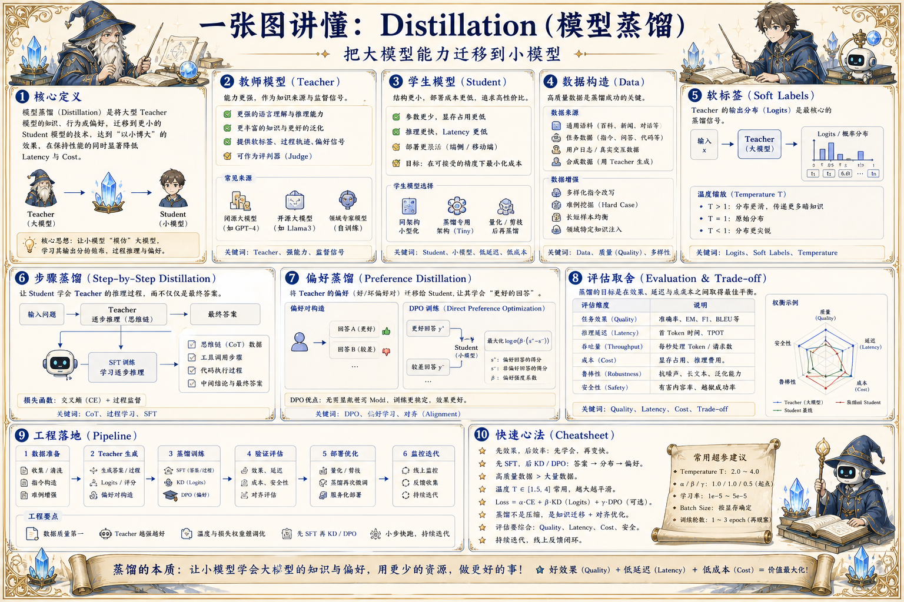

# LLM Distillation 蒸馏地图：把大模型能力迁移到小模型

> 模型蒸馏通过教师模型生成数据、软标签、推理轨迹和偏好信号，训练更小、更快、更便宜的学生模型。

## 一句话

蒸馏不是复制一个大模型，而是在明确场景里把最有价值的行为压缩成更低成本的能力。

## 标准流程

1. 定义任务
2. 选择教师
3. 构造数据
4. 生成标签
5. 训练学生
6. 对齐评测
7. 压缩部署
8. 反馈迭代

## 知识拆解

### 核心定义

- Distillation 是把教师模型能力迁移到学生模型
- 学生模型更小、更快、更易部署
- 适合固定领域、固定任务和成本敏感场景
- 目标不是全能复制，而是场景化压缩

### 教师模型

- 教师模型可以是闭源大模型或内部强模型
- 负责生成答案、解释、评分或偏好数据
- 教师质量决定蒸馏上限
- 多个教师可提升多样性和鲁棒性

### 学生模型

- 学生模型根据部署环境选择规模
- 小模型更低延迟和成本，但容量有限
- 需要 tokenizer、架构和训练资源匹配
- 学生能力边界要在产品中显式管理

### 数据构造

- 收集真实任务、长尾样本和边界样本
- 教师生成回答、步骤、工具计划或结构化结果
- 过滤低质量、重复、泄露和违规样本
- 保留 prompt、teacher、版本和评分信息

### 软标签

- 传统蒸馏使用 teacher logits 或概率分布
- LLM 场景常用生成答案和推理过程
- 软目标比硬标签提供更多行为信息
- 闭源教师通常只能获得输出而非 logits

### 步骤蒸馏

- 让学生学习中间推理、计划或工具使用过程
- 适合数学、代码、Agent 任务
- 步骤质量需要严格过滤
- 过长推理会增加训练成本和泄露风险

### 偏好蒸馏

- 教师或人类对候选答案排序
- 学生学习更符合偏好的输出
- 可结合 DPO、奖励模型或拒绝采样
- 注意不要放大师生共同幻觉

### 评估取舍

- 比较学生与教师在目标任务上的差距
- 同时评估延迟、成本、显存和稳定性
- 检查学生是否继承教师错误和偏见
- 用真实线上任务验证收益

### 工程落地

- 先蒸馏单一高价值场景
- 建立教师生成、过滤、训练、评测流水线
- 学生模型发布后继续收集失败样本
- 必要时与量化、LoRA 和路由结合部署

## 实践检查清单

- 先确定要蒸馏的任务边界和质量目标
- 教师输出要经过过滤和多样性控制
- 学生模型大小要匹配部署成本和延迟要求
- 评测必须覆盖老师强项和老师错误
- 蒸馏数据来源和授权要可追踪

## 维护说明

本文由 `content/notes/ai-knowledge-topics.json` 的结构化内容生成。
如果需要调整正文或海报文字，请先修改数据源，再运行 `python3 scripts/build_knowledge_posters.py`。
如果只想更新单个主题，可以在命令后追加 slug，例如 `python3 scripts/build_knowledge_posters.py agent-harness`。
脚本默认不会覆盖已存在的海报；如需生成程序化草稿图，请显式追加 `--overwrite-posters`。
