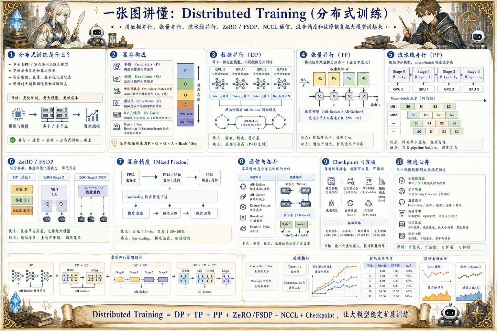

# Distributed Training 分布式训练地图：把大模型训起来

> 分布式训练通过数据并行、张量并行、流水线并行、ZeRO/FSDP、NCCL 通信、混合精度和故障恢复提升训练规模。

## 一句话

分布式训练的核心，是把模型、数据、梯度、显存和通信拆开，同时不让吞吐和稳定性失控。

## 标准流程

1. 切分数据
2. 切分模型
3. 前向计算
4. 反向传播
5. 梯度同步
6. 参数更新
7. 保存状态
8. 故障恢复

## 知识拆解

### 核心定义

- 分布式训练让多个 GPU / 节点共同训练大模型
- 目标是突破单卡显存和算力限制
- 常见拆分对象是数据、张量、层和优化器状态
- 规模越大越依赖通信和故障恢复

### 数据并行 DP

- 每张卡保存完整模型副本
- 不同卡处理不同 batch 分片
- 反向后同步梯度
- 简单稳定但显存冗余较高

### 张量并行 TP

- 把大矩阵乘法拆到多张卡
- 适合单层参数过大场景
- 需要频繁通信聚合结果
- 节点内高速互联更适合 TP

### 流水线并行 PP

- 按层把模型切到不同设备
- micro-batch 填充流水线
- 能降低单卡显存压力
- 会带来 pipeline bubble 和调度复杂度

### ZeRO / FSDP

- 切分参数、梯度和优化器状态
- 显著降低数据并行显存冗余
- 需要权衡通信开销和重构成本
- 适合超大模型训练和微调

### 混合精度

- FP16/BF16 降低显存和提升吞吐
- loss scaling 防止梯度下溢
- 关键算子可保留高精度
- 数值稳定性需要持续监控

### 通信与拓扑

- NCCL 负责 GPU 间集合通信
- 带宽和延迟决定扩展效率
- 节点内 NVLink 与节点间 InfiniBand 差异很大
- 并行策略要匹配物理拓扑

### Checkpoint

- 保存模型参数、优化器状态、学习率调度和随机状态
- 分片 checkpoint 需要一致性和校验
- 支持断点续训和节点故障恢复
- 保存过频会影响训练吞吐

### 工程落地

- 先小规模验证 loss 和吞吐
- 逐步扩卡观察 scaling efficiency
- 建立集群监控和失败重试
- 用实验管理记录并行策略、超参和数据版本

## 实践检查清单

- 先估算参数、激活值、优化器状态和 batch 所需显存
- 并行策略要结合模型大小、网络带宽和集群拓扑
- NCCL 通信瓶颈会吞掉扩卡收益
- checkpoint 要保存模型、优化器、调度器和随机状态
- 训练监控要覆盖吞吐、loss、显存、通信和节点健康

## 维护说明

本文由 `content/notes/ai-knowledge-topics.json` 的结构化内容生成。
如果需要调整正文或海报文字，请先修改数据源，再运行 `python3 scripts/build_knowledge_posters.py`。
如果只想更新单个主题，可以在命令后追加 slug，例如 `python3 scripts/build_knowledge_posters.py agent-harness`。
脚本默认不会覆盖已存在的海报；如需生成程序化草稿图，请显式追加 `--overwrite-posters`。
