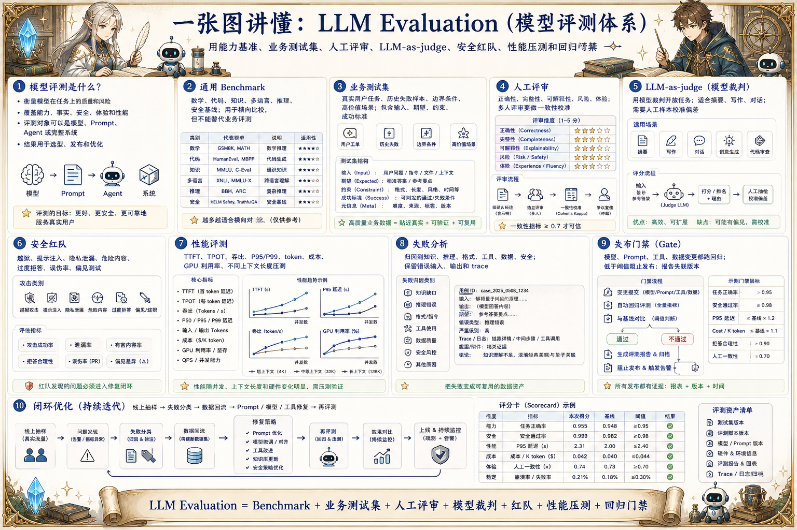

# LLM Evaluation 评测地图：判断模型到底强在哪里

> 大模型评测通过能力基准、业务测试集、人工评审、LLM-as-judge、安全红队、性能压测和回归门禁衡量模型质量。

## 一句话

评测不是为了给模型打一个漂亮分数，而是为了知道它在哪些任务上可靠、在哪些边界会失败。

## 标准流程

1. 定义目标
2. 选择基准
3. 构造数据集
4. 运行评测
5. 人工复核
6. 分析失败
7. 设定门禁
8. 回流样本

## 知识拆解

### 核心定义

- LLM Evaluation 衡量模型在任务上的质量和风险
- 覆盖能力、事实、安全、体验和性能
- 评测对象可以是模型、Prompt、Agent 或完整系统
- 评测结果用于选型、发布和优化

### 通用基准

- 数学、代码、知识、多语言和推理基准
- 便于横向比较不同模型
- 可能和真实业务差距较大
- 要警惕训练数据污染

### 业务测试集

- 从真实用户任务和历史失败构造样本
- 包含输入、期望、约束和成功标准
- 覆盖长尾、异常和高价值场景
- 是上线决策最重要的评测资产

### 人工评审

- 适合评估语义质量和业务可用性
- 评审维度要明确且可复用
- 多人评审需要一致性校准
- 高风险样本保留人工终审

### 模型裁判

- LLM-as-judge 可扩展评测规模
- 适合摘要、写作、对话等开放任务
- 需要人工样本校准偏差
- 裁判提示词和模型版本要固定

### 安全红队

- 测试越狱、提示注入、隐私泄漏和危险内容
- 覆盖拒答质量和误伤率
- 红队样本持续更新
- 结果进入安全训练和 Guardrails

### 性能评测

- 衡量 TTFT、TPOT、吞吐、P95/P99 延迟
- 记录 token、成本、GPU 利用率
- 压测不同并发和上下文长度
- 性能和质量要一起看

### 失败分析

- 把失败归因到知识、推理、格式、工具、数据或安全
- 统计高频失败类型
- 保留错误输入、输出和 trace
- 失败样本回流到训练和回归集

### 工程落地

- 建立离线评测和线上抽样双通道
- 发布前设置质量与成本门禁
- 报告关联模型、Prompt、数据和代码版本
- 把评测接入 CI / CD 和模型注册

## 实践检查清单

- 通用 benchmark 只能提供参考，不能替代业务评测
- 评测集要覆盖正常、边界、拒答和高风险场景
- LLM-as-judge 要用人工样本校准
- 每次模型、Prompt、工具或数据变化都要回归
- 评测报告要和版本、配置、成本、延迟一起记录

## 维护说明

本文由 `content/notes/ai-knowledge-topics.json` 的结构化内容生成。
如果需要调整正文或海报文字，请先修改数据源，再运行 `python3 scripts/build_knowledge_posters.py`。
如果只想更新单个主题，可以在命令后追加 slug，例如 `python3 scripts/build_knowledge_posters.py agent-harness`。
脚本默认不会覆盖已存在的海报；如需生成程序化草稿图，请显式追加 `--overwrite-posters`。
