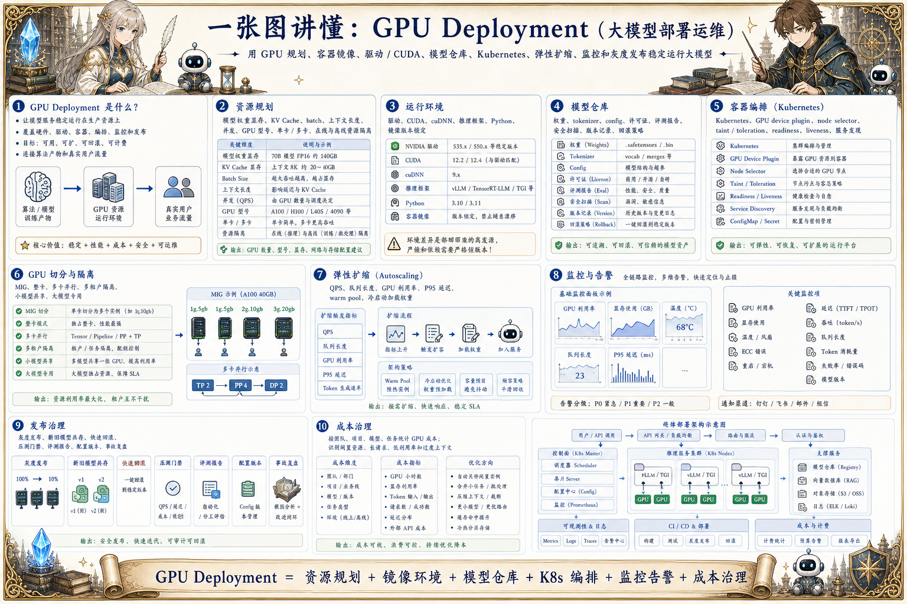

# GPU Deployment 部署地图：让模型稳定跑在生产环境

> 大模型部署需要 GPU 规划、容器镜像、驱动/CUDA、模型仓库、Kubernetes、弹性扩缩、监控、灰度和成本治理。

## 一句话

大模型部署的难点不只是显卡够不够，而是资源、镜像、模型、服务、监控和发布流程能不能稳定协同。

## 标准流程

1. 选择模型
2. 评估显存
3. 构建镜像
4. 挂载权重
5. 启动服务
6. 健康检查
7. 灰度发布
8. 监控扩缩

## 知识拆解

### 核心定义

- GPU Deployment 是让模型服务稳定运行在生产资源上
- 覆盖硬件、驱动、容器、编排、监控和发布
- 目标是可用、可扩、可回滚、可计费
- 它连接算法产物和真实用户流量

### 资源规划

- 估算模型权重显存、KV Cache 和 batch 需求
- 选择 GPU 型号、数量和并行策略
- 区分在线低延迟和离线批处理资源
- 预留峰值流量和故障转移容量

### 运行环境

- 锁定驱动、CUDA、cuDNN、推理框架和 Python 版本
- 镜像包含服务代码和依赖
- 权重通常通过模型仓库或挂载加载
- 环境差异是部署事故高发点

### 模型仓库

- 保存权重、tokenizer、config 和安全扫描结果
- 记录模型来源、版本、许可证和评测报告
- 支持回滚到旧模型
- 不同环境使用明确的模型版本

### 容器编排

- Kubernetes 负责调度、重启和服务发现
- GPU 节点需要 device plugin
- readiness / liveness 探针保护服务质量
- 节点亲和性和污点用于资源隔离

### GPU 切分

- MIG 可把单卡切成多个隔离实例
- 适合小模型或多租户场景
- 大模型通常需要整卡或多卡并行
- 切分策略要结合延迟和成本测试

### 弹性扩缩

- 按 QPS、队列长度、GPU 利用率和延迟扩缩容
- 冷启动加载权重耗时较长
- 可用 warm pool 降低扩容延迟
- 离线任务和在线服务要避免抢占

### 监控告警

- 监控 GPU 利用率、显存、温度、错误和重启
- 监控服务延迟、吞吐、队列、token 和失败率
- 异常要关联模型版本和部署版本
- 告警要区分资源瓶颈、模型错误和上游流量

### 发布治理

- 灰度发布新模型和新镜像
- 保留旧版本用于快速回滚
- 用压测和评测作为上线门禁
- 按团队、项目、模型统计 GPU 成本

## 实践检查清单

- 部署前先估算权重、KV Cache、并发和上下文长度所需显存
- CUDA、驱动、框架和镜像版本必须锁定
- 模型权重、tokenizer 和配置要进入模型仓库
- 服务要有 readiness、liveness 和压测指标
- GPU 成本需要按业务、模型和任务持续观测

## 维护说明

本文由 `content/notes/ai-knowledge-topics.json` 的结构化内容生成。
如果需要调整正文或海报文字，请先修改数据源，再运行 `python3 scripts/build_knowledge_posters.py`。
如果只想更新单个主题，可以在命令后追加 slug，例如 `python3 scripts/build_knowledge_posters.py agent-harness`。
脚本默认不会覆盖已存在的海报；如需生成程序化草稿图，请显式追加 `--overwrite-posters`。
