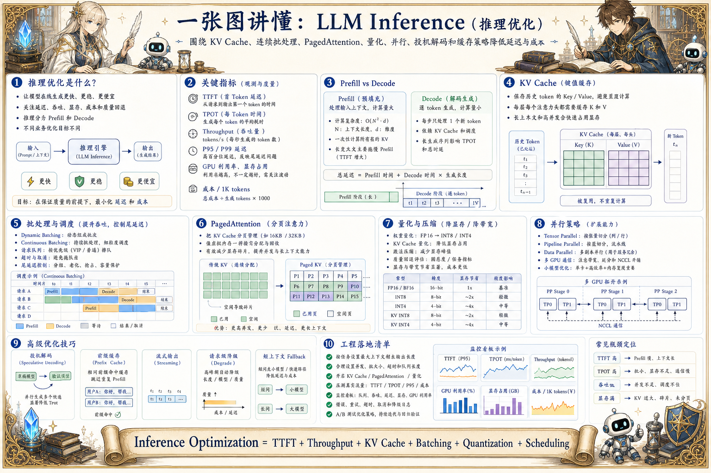

# LLM Inference 推理优化地图：让大模型更快更省

> 推理优化围绕 KV Cache、连续批处理、PagedAttention、量化、并行、投机解码和缓存策略降低延迟与成本。

## 一句话

推理优化的本质，是在质量、延迟、吞吐、显存和成本之间做可观测、可配置的工程取舍。

## 标准流程

1. 接收请求
2. 分词入队
3. Prefill
4. Decode
5. KV Cache
6. 批处理调度
7. 输出流式返回
8. 监控成本

## 知识拆解

### 核心定义

- 推理优化让模型在线生成更快、更稳、更便宜
- 关注延迟、吞吐、显存、成本和质量回退
- 推理包含 prefill 和 decode 两个阶段
- 不同场景的优化目标不一样

### 关键指标

- TTFT：首 token 延迟
- TPOT：每 token 生成时间
- Throughput：单位时间生成 token 数
- P95/P99 延迟衡量用户体验尾部风险

### KV Cache

- KV Cache 保存历史 token 的注意力键值
- 避免每步重复计算全部上下文
- 长上下文和高并发会迅速占用显存
- 缓存管理直接影响吞吐和稳定性

### 批处理调度

- 动态批处理合并同时到来的请求
- 连续批处理让 decode 阶段持续填满 GPU
- 不同长度请求会造成 padding 或调度碎片
- 调度要平衡吞吐和尾延迟

### PagedAttention

- 把 KV Cache 像分页内存一样管理
- 减少显存碎片并支持更多并发
- 适合长上下文和多请求服务
- 常见于高性能推理框架

### 量化压缩

- INT8/INT4 降低权重显存和带宽
- KV Cache 也可以做量化优化
- 量化可能影响数学、代码和长上下文能力
- 需要用业务评测集验证质量

### 并行策略

- 张量并行拆分大矩阵
- 流水线并行拆分层
- 多 GPU 服务要考虑通信开销
- 小模型可能单卡更高效

### 高级优化

- 投机解码用小模型草拟 token
- Prefix Cache 复用相同系统提示和上下文前缀
- 流式输出改善感知延迟
- 请求级降级控制成本和超时

### 工程落地

- 按任务设置最大上下文和最大输出
- 监控 GPU 利用率、显存、队列长度和错误
- 为不同模型配置不同批大小和并发
- 用真实流量压测而不是只看单请求速度

## 实践检查清单

- 区分首 token 延迟 TTFT 和生成吞吐 tokens/s
- 长上下文主要消耗 KV Cache 和 prefill 时间
- 连续批处理能提高 GPU 利用率但会影响尾延迟
- 量化能省显存和成本但要评估质量回退
- 不同业务要设置不同最大长度、并发和降级策略

## 维护说明

本文由 `content/notes/ai-knowledge-topics.json` 的结构化内容生成。
如果需要调整正文或海报文字，请先修改数据源，再运行 `python3 scripts/build_knowledge_posters.py`。
如果只想更新单个主题，可以在命令后追加 slug，例如 `python3 scripts/build_knowledge_posters.py agent-harness`。
脚本默认不会覆盖已存在的海报；如需生成程序化草稿图，请显式追加 `--overwrite-posters`。
