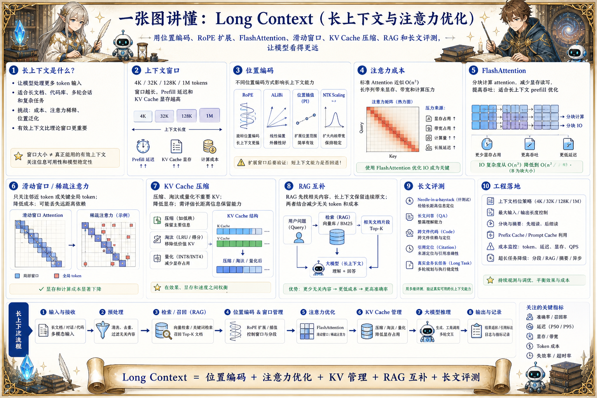

# Long Context 长上下文地图：让模型看得更远

> 长上下文能力依赖位置编码、RoPE 扩展、FlashAttention、滑动窗口、KV Cache 压缩、检索增强和长文评测。

## 一句话

长上下文不是把窗口无限拉长，而是让模型在更大信息空间里仍然找得到、记得住、答得准。

## 标准流程

1. 扩展窗口
2. 调整位置编码
3. 优化注意力
4. 管理 KV Cache
5. 压缩上下文
6. 检索补充
7. 长文评测
8. 上线限额

## 知识拆解

### 核心定义

- 长上下文让模型处理更多 token 输入
- 适合长文档、代码库、多轮会话和复杂任务
- 挑战是成本、注意力稀释和位置泛化
- 有效上下文比理论窗口更重要

### 上下文窗口

- 窗口定义单次可输入的最大 token 数
- 长窗口提升信息承载能力
- 也增加 prefill 时间和 KV Cache 显存
- 业务应设置合理输入和输出上限

### 位置编码

- 位置编码让模型知道 token 顺序
- RoPE 是常见旋转位置编码
- 位置插值可扩展窗口
- 扩展后需要验证短文本和长文本能力

### 注意力成本

- 标准注意力复杂度随长度平方增长
- 长上下文对显存和带宽压力大
- FlashAttention 优化 IO 和显存访问
- 稀疏注意力降低部分计算成本

### 滑动窗口

- 只关注邻近 token 或分块范围
- 适合局部依赖强的任务
- 可能丢失远距离信息
- 常与全局 token 或检索结合

### KV 压缩

- 压缩或淘汰不重要 KV Cache
- 降低长上下文显存压力
- 可能影响后续生成质量
- 需要按任务验证信息保留能力

### RAG 互补

- RAG 先选相关信息再注入上下文
- 长上下文适合保留连续原文
- 两者结合可减少无关 token
- 检索质量仍然决定最终答案质量

### 长文评测

- Needle-in-a-haystack 测定位能力
- 长文问答测理解和引用
- 代码库任务测跨文件推理
- 真实业务任务比单一基准更重要

### 工程落地

- 为不同任务配置上下文档位
- 监控 prefill 延迟、显存和成本
- 对长文做分块摘要和引用定位
- 用 RAG、缓存和限额控制成本

## 实践检查清单

- 上下文越长，prefill 延迟和 KV Cache 显存越高
- RoPE 扩展需要评测短上下文能力是否回退
- 长窗口不等于有效利用全部信息
- RAG 与长上下文是互补关系，不是二选一
- 必须做 needle-in-a-haystack、长文问答和真实任务评测

## 维护说明

本文由 `content/notes/ai-knowledge-topics.json` 的结构化内容生成。
如果需要调整正文或海报文字，请先修改数据源，再运行 `python3 scripts/build_knowledge_posters.py`。
如果只想更新单个主题，可以在命令后追加 slug，例如 `python3 scripts/build_knowledge_posters.py agent-harness`。
脚本默认不会覆盖已存在的海报；如需生成程序化草稿图，请显式追加 `--overwrite-posters`。
