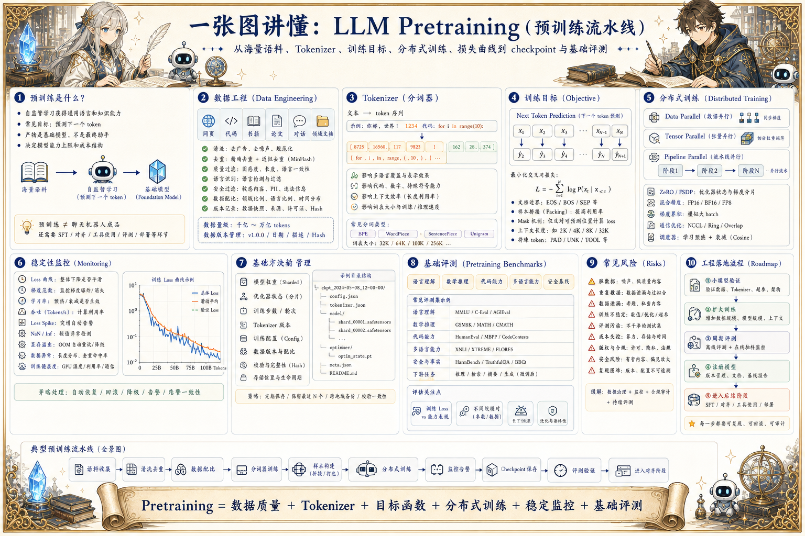

# LLM Pretraining 预训练地图：从数据到基础模型

> 预训练把海量语料、Tokenizer、目标函数、分布式训练、损失曲线和 checkpoint 管理串成基础模型生产线。

## 一句话

预训练不是把数据丢进 GPU，而是把数据质量、训练稳定性、并行效率和可评测能力组织成一条生产线。

## 标准流程

1. 收集语料
2. 清洗去重
3. 训练 Tokenizer
4. 构建样本
5. 分布式训练
6. 监控损失
7. 保存权重
8. 基础评测

## 知识拆解

### 核心定义

- 预训练让模型通过自监督学习获得通用语言和知识能力
- 常见目标是预测下一个 token
- 训练结果是 foundation model，不是最终产品助手
- 预训练阶段决定模型能力上限和成本结构

### 数据工程

- 收集网页、代码、书籍、论文、对话和领域文档
- 做去重、质量过滤、语言识别和安全过滤
- 控制不同来源的数据配比
- 保留数据版本、来源和清洗规则

### Tokenizer

- Tokenizer 把文本变成 token 序列
- 影响多语言、代码、数字和特殊符号效率
- 词表大小影响压缩率和模型输入长度
- 新增领域词需要权衡兼容性和训练成本

### 训练目标

- Decoder-only 模型常用 next token prediction
- Mask 或 span 目标适合部分架构
- 样本拼接要处理文档边界和特殊 token
- 目标函数看似简单，但数据构造决定效果

### 分布式训练

- 数据并行提升吞吐
- 张量并行拆矩阵计算
- 流水线并行拆层
- ZeRO / FSDP 降低显存占用

### 训练稳定性

- 监控 loss、梯度范数、学习率和吞吐
- 处理 loss spike、NaN、显存溢出和数据脏样本
- 学习率 warmup 与衰减影响收敛
- 异常 checkpoint 要能回滚和复现

### Checkpoint

- 定期保存模型权重、优化器状态和训练步数
- 区分继续训练、评测和发布用 checkpoint
- 保存 tokenizer、配置和数据版本
- 大模型 checkpoint 需要分片和校验

### 基础评测

- 评测语言理解、数学、代码、多语言和安全基线
- 同时看训练 loss 与下游任务表现
- 不同数据配比会改变能力结构
- 评测结果指导下一轮数据和训练策略

### 工程落地

- 建立数据、训练、评测和模型注册流水线
- 先用小模型验证数据和超参
- 训练过程所有配置进入实验管理
- 基础模型再进入 SFT、对齐、压缩和部署

## 实践检查清单

- 预训练质量首先取决于数据质量和数据配比
- Tokenizer 会影响上下文效率、多语言能力和特殊符号处理
- 训练稳定性需要关注 loss spike、梯度、学习率和数据异常
- checkpoint、日志和评测必须按版本管理
- 基础模型产物要能进入 SFT、对齐和部署流程

## 维护说明

本文由 `content/notes/ai-knowledge-topics.json` 的结构化内容生成。
如果需要调整正文或海报文字，请先修改数据源，再运行 `python3 scripts/build_knowledge_posters.py`。
如果只想更新单个主题，可以在命令后追加 slug，例如 `python3 scripts/build_knowledge_posters.py agent-harness`。
脚本默认不会覆盖已存在的海报；如需生成程序化草稿图，请显式追加 `--overwrite-posters`。
