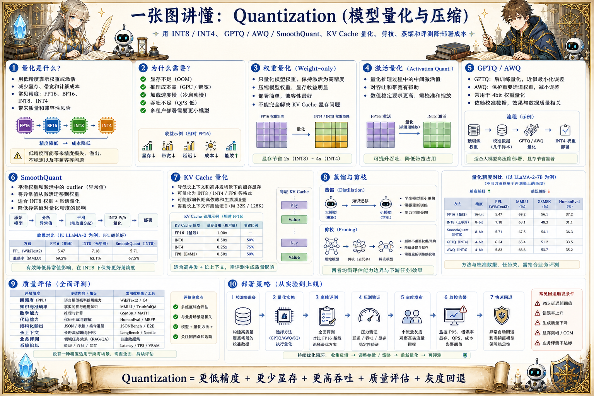

# Quantization 压缩地图：让模型更小更快

> 模型压缩通过 INT8/INT4 量化、GPTQ/AWQ/SmoothQuant、KV Cache 量化、剪枝、蒸馏和评测降低部署成本。

## 一句话

量化不是简单把模型变小，而是在显存、吞吐、延迟、质量和硬件支持之间做工程权衡。

## 标准流程

1. 选择模型
2. 准备校准集
3. 选择量化方法
4. 执行量化
5. 评测质量
6. 压测性能
7. 部署灰度
8. 监控回退

## 知识拆解

### 核心定义

- 量化用低精度表示权重或激活
- 目标是减少显存、带宽和计算成本
- 常见精度包括 FP16、BF16、INT8、INT4
- 压缩会带来质量和兼容性风险

### 权重量化

- 只压缩模型权重
- 部署简单且收益明显
- 对显存和加载速度帮助大
- 不能完全解决 KV Cache 显存问题

### 激活量化

- 压缩推理过程中的中间激活
- 对吞吐和显存都有帮助
- 对数值稳定性要求更高
- 需要硬件和框架支持

### GPTQ / AWQ

- GPTQ 用二阶近似做后训练量化
- AWQ 保护重要通道权重
- 常用于 4bit 权重量化
- 依赖校准数据和模型结构适配

### SmoothQuant

- 平滑权重和激活的异常值
- 更适合权重和激活一起量化
- 降低 outlier 对量化误差的影响
- 常用于 INT8 部署路线

### KV Cache 量化

- 降低长上下文和高并发的缓存显存
- 可能影响长距离依赖和生成质量
- 需要按上下文长度评测
- 适合显存瓶颈明显的服务

### 蒸馏剪枝

- 蒸馏用大模型指导小模型
- 剪枝删除不重要结构或通道
- 能降低计算量但训练成本更高
- 需要重新评测能力边界

### 质量评估

- 比较量化前后准确率、困惑度和业务指标
- 关注数学、代码、结构化输出和长上下文
- 压测 latency、吞吐和显存收益
- 用灰度流量观察线上回退

### 工程落地

- 从 INT8 或成熟 INT4 路线开始
- 建立标准校准集和评测集
- 为不同硬件保存不同模型格式
- 服务层保留高精度 fallback

## 实践检查清单

- 量化前先明确目标是省显存、提吞吐还是降成本
- 校准集要覆盖真实业务输入分布
- 数学、代码、长上下文和工具调用任务更容易受影响
- 量化格式要匹配推理框架和 GPU 硬件
- 上线需要灰度、监控和回退到高精度模型

## 维护说明

本文由 `content/notes/ai-knowledge-topics.json` 的结构化内容生成。
如果需要调整正文或海报文字，请先修改数据源，再运行 `python3 scripts/build_knowledge_posters.py`。
如果只想更新单个主题，可以在命令后追加 slug，例如 `python3 scripts/build_knowledge_posters.py agent-harness`。
脚本默认不会覆盖已存在的海报；如需生成程序化草稿图，请显式追加 `--overwrite-posters`。
