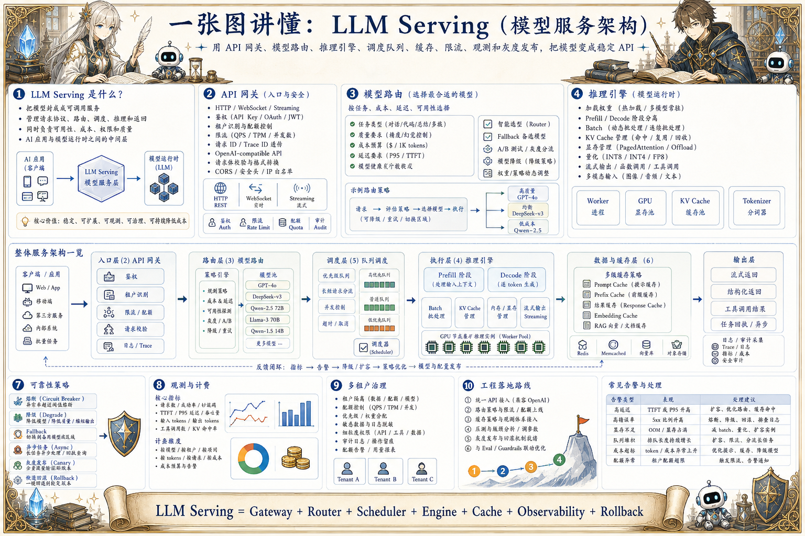

# LLM Serving 服务架构地图：把模型变成稳定 API

> 模型服务需要 API 网关、模型路由、推理引擎、调度队列、缓存、限流、观测、降级和多环境发布。

## 一句话

模型服务不是把权重跑起来，而是让不同模型、不同租户、不同负载在稳定边界内持续提供能力。

## 标准流程

1. 客户端请求
2. API 网关
3. 鉴权限流
4. 模型路由
5. 队列调度
6. 推理执行
7. 流式返回
8. 日志计费

## 知识拆解

### 核心定义

- LLM Serving 把模型封装成可调用服务
- 负责请求协议、路由、调度、推理和返回
- 同时管理可用性、成本、权限和质量
- 是 AI 应用与模型运行时之间的中间层

### API 网关

- 提供统一 HTTP / WebSocket / streaming 接口
- 处理鉴权、租户、配额和限流
- 屏蔽底层模型和推理框架差异
- 记录请求 ID 和 trace ID

### 模型路由

- 按任务、成本、延迟和可用性选择模型
- 支持主备模型和失败 fallback
- 可做 A/B 测试和灰度分流
- 路由策略要能被观测和解释

### 推理引擎

- 负责加载权重、执行 prefill 和 decode
- 管理 batch、KV Cache 和显存
- 支持张量并行、量化和流式输出
- 常与模型仓库和配置系统关联

### 队列调度

- 请求入队后按优先级和资源调度
- 防止突发流量压垮 GPU
- 支持超时、取消和重试
- 长请求和短请求可分队列处理

### 缓存策略

- Prompt / Prefix Cache 复用公共前缀
- 结果缓存适合确定性查询和低温度任务
- Embedding / RAG 可缓存检索结果
- 缓存要考虑权限、过期和版本

### 可靠性策略

- 熔断保护异常模型或节点
- 降级到小模型、短上下文或异步任务
- 灰度发布降低新模型风险
- 回滚要保留旧模型和旧配置

### 观测计费

- 记录 token、延迟、状态码、模型版本和成本
- 按用户、项目、模型和任务聚合指标
- 异常请求要能回放和诊断
- 计费与配额依赖准确 usage 数据

### 工程落地

- 先提供统一 OpenAI-compatible API
- 再增加路由、限流、缓存和观测
- 用压测决定批处理和并发参数
- 服务层要和 Agent Harness、Eval、Guardrails 联动

## 实践检查清单

- 服务层要区分模型能力、租户权限和成本预算
- 路由策略应支持模型降级、fallback 和 A/B 测试
- 队列和限流是保护 GPU 的第一道防线
- 日志、trace、token 和成本必须结构化
- 发布模型要支持灰度、回滚和版本隔离

## 维护说明

本文由 `content/notes/ai-knowledge-topics.json` 的结构化内容生成。
如果需要调整正文或海报文字，请先修改数据源，再运行 `python3 scripts/build_knowledge_posters.py`。
如果只想更新单个主题，可以在命令后追加 slug，例如 `python3 scripts/build_knowledge_posters.py agent-harness`。
脚本默认不会覆盖已存在的海报；如需生成程序化草稿图，请显式追加 `--overwrite-posters`。
