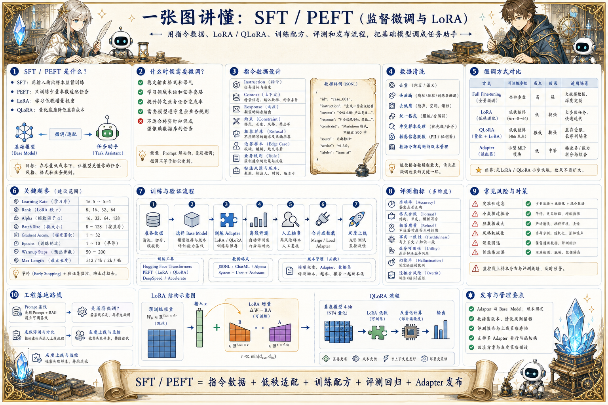

# SFT / PEFT 微调地图：把基础模型调成任务助手

> 监督微调和参数高效微调通过指令数据、LoRA/QLoRA、训练配方、评测和合并发布，让基础模型适配具体任务。

## 一句话

SFT 的目标不是让模型背答案，而是把基础能力引导到稳定的任务格式、风格和业务边界里。

## 标准流程

1. 定义任务
2. 准备指令数据
3. 清洗标注
4. 选择微调方式
5. 训练 Adapter
6. 验证评测
7. 合并发布
8. 线上回流

## 知识拆解

### 核心定义

- SFT 是用输入输出样本对模型做监督训练
- PEFT 用少量可训练参数适配任务
- LoRA 在权重旁边学习低秩增量
- QLoRA 用量化底座降低显存成本

### 适用场景

- 稳定输出格式和语气
- 学习领域术语和任务套路
- 提高特定业务任务完成率
- 不适合补实时知识或强依赖数据库的任务

### 数据设计

- 样本包含指令、上下文、期望输出和约束
- 覆盖正常、边界、拒答和错误输入
- 去除重复、泄漏、低质量和互相矛盾样本
- 保留数据来源、版本和标注规则

### 训练方式

- 全量微调效果强但成本高
- LoRA 适合低成本任务适配
- QLoRA 适合显存有限环境
- Adapter 可以按业务或客户拆分发布

### 关键超参

- 学习率影响稳定性和遗忘风险
- rank / alpha 影响可学习容量
- batch size 和梯度累积影响吞吐
- 训练轮次过多容易过拟合格式或样本

### 评测验证

- 离线集覆盖核心任务和边界任务
- 比较微调前后准确率、格式合规和拒答质量
- 人工抽查事实和业务可用性
- 不要只看训练 loss 下降

### 发布方式

- 可发布 adapter 或合并后的模型
- 记录 base model、数据版本和训练配置
- 不同业务 adapter 可以路由加载
- 回滚要能恢复旧 adapter

### 常见风险

- 灾难性遗忘会损伤原有能力
- 小数据过拟合会让模型机械套模板
- 脏数据会放大错误业务规则
- 微调不能替代权限、检索和工具治理

### 工程落地

- 先做 Prompt 基线，再评估是否微调
- 用小批量实验确定数据和超参
- 将训练、评测、发布纳入流水线
- 线上反馈形成持续数据闭环

## 实践检查清单

- 微调前先确认 Prompt / RAG / Tool 是否已经足够
- 数据质量比样本数量更重要
- LoRA rank、学习率和训练轮次需要小步实验
- 评测要覆盖格式、事实、拒答和业务边界
- 线上失败样本应回流为下一轮训练数据

## 维护说明

本文由 `content/notes/ai-knowledge-topics.json` 的结构化内容生成。
如果需要调整正文或海报文字，请先修改数据源，再运行 `python3 scripts/build_knowledge_posters.py`。
如果只想更新单个主题，可以在命令后追加 slug，例如 `python3 scripts/build_knowledge_posters.py agent-harness`。
脚本默认不会覆盖已存在的海报；如需生成程序化草稿图，请显式追加 `--overwrite-posters`。
