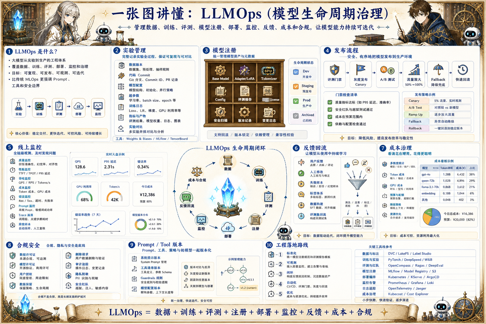

# LLMOps 生命周期地图：从实验到生产的模型治理

> LLMOps 管理数据、训练、评测、模型注册、部署、监控、反馈、成本和合规，让模型能力持续可迭代。

## 一句话

LLMOps 的价值，是让一次模型实验变成可追踪、可发布、可回滚、可持续优化的生产系统。

## 标准流程

1. 数据准备
2. 实验训练
3. 离线评测
4. 模型注册
5. 灰度部署
6. 线上监控
7. 反馈回流
8. 迭代优化

## 知识拆解

### 核心定义

- LLMOps 是大模型从实验到生产的工程体系
- 覆盖数据、训练、评测、部署、监控和治理
- 目标是可复现、可发布、可观测、可迭代
- 比传统 MLOps 更强调 Prompt、工具和安全边界

### 实验管理

- 记录数据版本、代码 commit、模型配置和超参
- 保存训练日志、指标和产物
- 支持对比不同模型和训练策略
- 实验结果要能复现而不是只靠截图

### 模型注册

- 登记 base model、adapter、tokenizer 和配置
- 关联评测报告、许可证和安全扫描
- 标记 dev、staging、prod 状态
- 支持版本查找、审批和回滚

### 发布流程

- 通过评测门禁后进入灰度
- 按用户、租户、任务或流量比例发布
- 保留旧版本 fallback
- 发布配置和模型版本要一起变更

### 线上监控

- 监控质量、延迟、吞吐、成本和错误
- 采集 prompt、模型、工具和 trace 摘要
- 敏感信息脱敏和权限控制
- 异常样本进入排查队列

### 反馈回流

- 用户反馈、人工修改和失败样本进入数据池
- 按失败类型打标签
- 高价值样本进入 SFT、对齐或评测集
- 回流要避免污染和隐私泄漏

### 成本治理

- 按模型、任务、租户和团队统计 token 与 GPU 成本
- 识别过长上下文和无效循环
- 支持预算、配额和降级策略
- 成本优化不能脱离质量评估

### 合规安全

- 管理数据许可证、模型许可证和第三方依赖
- 记录用户授权和数据保留策略
- 支持删除请求和审计追踪
- 安全事故要进入复盘和规则更新

### 工程落地

- 先从模型注册和评测报告标准化开始
- 逐步接入部署、监控和反馈回流
- 将 Prompt、工具和 Guardrails 纳入版本管理
- 让每一次模型变更都可解释、可回滚

## 实践检查清单

- 所有模型产物都要绑定数据、代码、配置和评测报告
- 发布流程必须支持灰度、回滚和权限控制
- 线上监控要同时看质量、性能、成本和安全
- 用户反馈和失败 trace 要能回流到数据与评测
- 合规、隐私和许可证信息不能靠人工记忆维护

## 维护说明

本文由 `content/notes/ai-knowledge-topics.json` 的结构化内容生成。
如果需要调整正文或海报文字，请先修改数据源，再运行 `python3 scripts/build_knowledge_posters.py`。
如果只想更新单个主题，可以在命令后追加 slug，例如 `python3 scripts/build_knowledge_posters.py agent-harness`。
脚本默认不会覆盖已存在的海报；如需生成程序化草稿图，请显式追加 `--overwrite-posters`。
