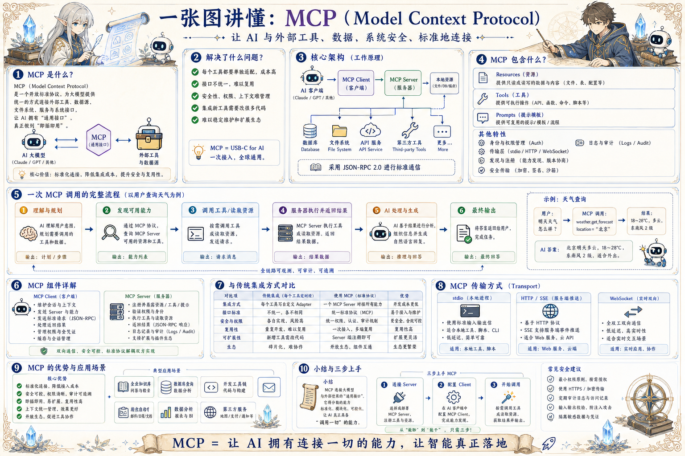

# MCP 连接协议地图：让 AI 安全接入外部能力

> Model Context Protocol 将资源、工具和提示词以统一协议暴露给 AI 客户端，降低集成成本并增强边界控制。

## 一句话

MCP 的价值不是多一个接口名，而是给 AI 客户端和外部能力之间建立标准、可控、可发现的边界。

## 标准流程

1. 启动 Server
2. 发现能力
3. 读取资源
4. 选择工具
5. 执行调用
6. 返回结果
7. 记录日志
8. 治理权限

## 知识拆解

### 核心定义

- MCP 是连接 AI 客户端与外部能力的开放协议
- 它让工具、资源和提示词以统一方式被发现和调用
- 目标是降低集成成本并增强安全治理
- 适合 IDE、Agent 工作台和企业内部系统

### Client

- Client 是使用能力的一方，如 AI 应用或 Agent
- 负责发现 Server 能力并发起调用
- 需要处理用户授权和交互呈现
- 也要限制模型能看到和能调用的内容

### Server

- Server 包装外部系统能力
- 暴露 Resources、Tools 和 Prompts
- 负责鉴权、输入校验、执行和日志
- 可以连接数据库、文件系统、API 或内部服务

### Resources

- Resources 提供可读取上下文
- 适合文件、配置、知识库、数据记录
- 资源需要 URI、类型、权限和更新时间
- 读取资源不等于允许写状态

### Tools

- Tools 提供可执行动作
- 需要清楚的名称、描述、参数和返回结构
- 高风险工具必须限制权限和审批
- 工具失败应返回结构化错误

### Prompts

- Prompts 提供可复用提示词模板
- 可封装角色、流程、检查清单和输出格式
- 模板要版本化并说明适用场景
- 不应把敏感规则散落在临时对话中

### Transport

- stdio 适合本地工具和桌面集成
- HTTP / SSE 适合远程服务和云端能力
- 传输层要处理连接、超时和错误
- 安全环境里要限制网络和文件访问

### 权限与审计

- 按工具、资源和用户身份做权限裁剪
- 记录每次读取、调用、写入和错误
- 敏感字段脱敏展示和存储
- 支持撤销授权和禁用危险工具

### 工程落地

- 先从只读资源和低风险工具开始
- 为每个 Server 写清能力边界和示例
- 建立健康检查、版本和兼容策略
- 把 MCP 接入纳入 Agent 的运行策略文档

## 实践检查清单

- 资源、工具、提示词要分清，避免接口职责混乱
- Server 只暴露必要能力，按最小权限配置
- 工具调用要有输入校验、错误返回和审计日志
- 客户端需要可发现 capability，而不是硬编码所有细节
- 本地、HTTP、SSE 等传输方式要按场景选择

## 维护说明

本文由 `content/notes/ai-knowledge-topics.json` 的结构化内容生成。
如果需要调整正文或海报文字，请先修改数据源，再运行 `python3 scripts/build_knowledge_posters.py`。
