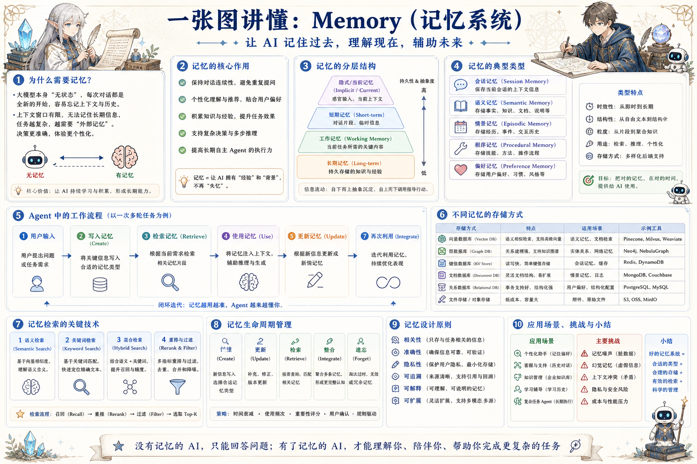

# AI Memory 记忆系统地图：记住该记的，忘掉该忘的

> 区分会话、语义、情节、程序和偏好记忆，并设计写入、检索、更新、遗忘与隐私边界。

## 一句话

好的记忆系统不是记住一切，而是让 Agent 在需要时找到可信、相关、可解释的信息。

## 标准流程

1. 捕获信息
2. 判断价值
3. 写入记忆
4. 建立索引
5. 按需检索
6. 使用验证
7. 更新合并
8. 过期遗忘

## 知识拆解

### 核心定义

- 记忆让 Agent 跨轮次、跨任务保留有价值信息
- 它不是简单聊天记录，而是可检索知识资产
- 记忆需要写入、检索、更新和删除机制
- 长期记忆必须服从隐私和权限边界

### 会话记忆

- 保存当前对话和任务上下文
- 适合短期连续任务和临时偏好
- 窗口结束后可摘要归档或丢弃
- 过长会造成噪声和 token 成本

### 语义记忆

- 保存稳定事实、知识和业务规则
- 常用向量库或知识库检索
- 需要版本、来源和可信度
- 适合公司制度、产品文档和用户资料

### 情节记忆

- 保存事件、经历和交互历史
- 帮助 Agent 理解过去发生过什么
- 适合项目复盘、客户沟通和任务轨迹
- 检索时要关注时间线和因果关系

### 程序记忆

- 保存方法、流程、脚本和操作步骤
- 让 Agent 复用成熟工作流
- 适合 SOP、工具用法和故障处理
- 必须随系统版本变化更新

### 偏好记忆

- 保存用户稳定偏好、语气和默认选择
- 偏好应可查看、可修改、可删除
- 不能把一次选择误判为长期偏好
- 高风险偏好需要用户确认

### 检索策略

- 语义检索找相近记忆
- 关键词检索找精确术语
- 时间衰减处理新旧信息优先级
- 重排过滤去掉无关、过期和越权内容

### 生命周期

- Create：从交互中捕获候选记忆
- Update：同类信息合并或覆盖
- Retrieve：按任务检索相关记忆
- Forget：按过期、撤销或隐私要求删除

### 工程落地

- 分库保存不同类型记忆
- 为每条记忆记录来源和使用记录
- 支持用户审计和删除请求
- 评估记忆命中率、误用率和隐私风险

## 实践检查清单

- 记忆写入要有来源、时间和置信度
- 偏好、事实和任务状态不能混在一起
- 敏感信息需要权限、脱敏和删除能力
- 检索时按任务相关性和新鲜度排序
- 遗忘策略是记忆系统的一部分，不是事后清理

## 维护说明

本文由 `content/notes/ai-knowledge-topics.json` 的结构化内容生成。
如果需要调整正文或海报文字，请先修改数据源，再运行 `python3 scripts/build_knowledge_posters.py`。
