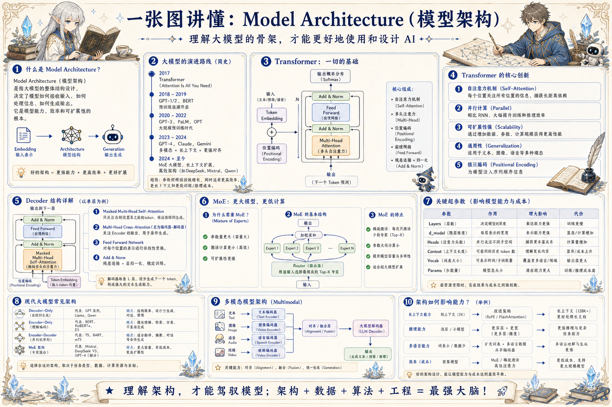

# 大模型架构知识地图：看懂能力背后的骨架

> 从 Token、Embedding、Attention、Transformer、MoE 到多模态与推理成本，理解模型为什么这样工作。

## 一句话

理解架构不是为了背名词，而是为了知道能力、成本、延迟和边界从哪里来。

## 标准流程

1. 文本切分
2. Embedding
3. Attention
4. 层堆叠
5. 输出分布
6. 采样解码
7. 工具增强
8. 部署优化

## 知识拆解

### Token 与 Embedding

- Token 是模型处理文本的基本单位
- Embedding 把离散 token 映射到连续向量
- 词表、语种和分词会影响效率
- 上下文长度本质上是可处理 token 的窗口

### Attention

- Attention 让每个位置关注其他位置
- Query、Key、Value 决定信息如何加权
- Self-Attention 捕捉序列内部依赖
- 注意力成本随长度增加快速上升

### Transformer Block

- 常见结构包含 Attention、FFN、残差和归一化
- 多层堆叠形成更复杂的表示能力
- FFN 承担大量非线性变换
- 训练稳定性依赖初始化、归一化和优化器

### Decoder / Encoder

- Decoder-only 常用于自回归生成
- Encoder-only 擅长理解、分类和检索表示
- Encoder-Decoder 适合翻译、摘要等序列到序列任务
- 现代通用大模型多采用 Decoder-only 路线

### MoE 架构

- Mixture of Experts 将部分层拆成专家
- Router 为每个 token 选择少量专家激活
- 总参数大，但每次计算只用一部分
- 路由均衡和通信成本是关键难点

### 上下文与位置

- 位置编码帮助模型理解顺序
- RoPE、ALiBi 等方法支持长度泛化
- 长上下文会带来注意力稀释和成本问题
- 结构化上下文能比盲目拉长窗口更有效

### 多模态融合

- 图片、语音、视频需要各自编码器
- 对齐层把不同模态映射到共享表示
- 融合策略影响推理能力和延迟
- 评估要覆盖识别、定位、推理和幻觉

### 推理成本

- Prefill 受输入长度影响明显
- Decode 受输出 token 数和缓存影响
- KV Cache 能加速但会占用显存
- 量化、并行和批处理影响吞吐

### 工程选择

- 小模型适合低延迟、低成本固定任务
- 大模型适合复杂推理和开放任务
- 网关层负责模型路由、降级和观测
- 真实系统通常需要模型、工具、检索协同

## 实践检查清单

- 看模型时同时看上下文、吞吐、延迟和成本
- 多模态不是只加图片入口，还要处理对齐与融合
- MoE 降低激活成本，但增加路由和部署复杂度
- 长上下文不能替代检索、压缩和结构化上下文
- 架构选择要服务任务，而不是追逐参数规模

## 维护说明

本文由 `content/notes/ai-knowledge-topics.json` 的结构化内容生成。
如果需要调整正文或海报文字，请先修改数据源，再运行 `python3 scripts/build_knowledge_posters.py`。
