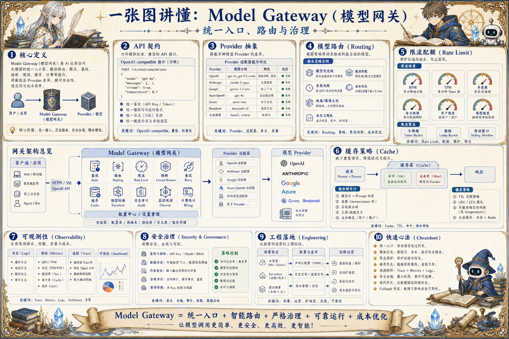

# Model Gateway 模型网关地图：统一入口、路由与治理

> 模型网关把多 Provider、多模型、鉴权、路由、限流、缓存、成本、降级和观测收敛成稳定的大模型入口。

## 一句话

模型网关的价值，是让业务系统只面对一个稳定入口，而不是直接承受每个 Provider 的差异和波动。

## 标准流程

1. 接收请求
2. 鉴权限流
3. 选择模型
4. 路由 Provider
5. 注入策略
6. 调用模型
7. 记录观测
8. 降级优化

## 知识拆解

### 核心定义

- Model Gateway 是大模型调用的统一入口
- 它屏蔽 Provider API 差异
- 负责鉴权、路由、策略、观测和治理
- 适合多模型、多业务、多环境的 AI 系统

### API 契约

- 常用 OpenAI-compatible 形式降低接入成本
- 统一 chat、completion、embedding、rerank 等能力
- 保留 provider-specific 参数扩展区
- 响应格式、错误码和流式协议要稳定

### Provider 抽象

- 每个 Provider 封装认证、参数转换和错误处理
- 模型能力、上下文长度和价格进入配置
- 支持本地模型、云模型和代理服务
- Provider SDK 变化不应扩散到业务层

### 模型路由

- 按任务类型、质量要求和成本选择模型
- 低风险任务走便宜模型，高难任务走强模型
- 支持 A/B、灰度、fallback 和地域路由
- 路由结果写入 trace 便于复盘

### 限流配额

- 按用户、项目、模型和 Provider 控制 QPS 与额度
- 防止突发任务拖垮共享 Provider
- 预算快耗尽时降级或提醒
- 后台需要可视化配额和使用趋势

### 缓存策略

- Embedding、Rerank 和确定性请求适合缓存
- 生成类请求需要谨慎处理上下文敏感性
- 缓存 key 包含模型、参数和输入摘要
- 缓存命中率直接影响成本和延迟

### 可观测性

- 记录 token、耗时、状态码、错误类型和成本
- 按模型、Provider、业务和用户聚合指标
- 异常峰值触发告警
- 保留采样请求用于质量分析和回归

### 安全治理

- API Key 加密存储并按环境隔离
- 敏感 Prompt 和响应脱敏记录
- 高风险模型访问需要权限
- 审计谁在何时调用了什么模型

### 工程落地

- 先统一入口，再逐步增加路由和策略
- 配置中心管理模型、价格和能力
- 网关和 Agent Harness、LLMOps 联动
- 通过压测确定限流、队列和超时参数

## 实践检查清单

- 统一 API 契约优先于堆 Provider SDK
- 路由策略要看任务、成本、延迟和可用性
- Key、配额和权限必须隔离管理
- 所有请求记录模型、版本、成本和错误
- Provider 异常要能降级、重试或熔断

## 维护说明

本文由 `content/notes/ai-knowledge-topics.json` 的结构化内容生成。
如果需要调整正文或海报文字，请先修改数据源，再运行 `python3 scripts/build_knowledge_posters.py`。
如果只想更新单个主题，可以在命令后追加 slug，例如 `python3 scripts/build_knowledge_posters.py agent-harness`。
脚本默认不会覆盖已存在的海报；如需生成程序化草稿图，请显式追加 `--overwrite-posters`。
