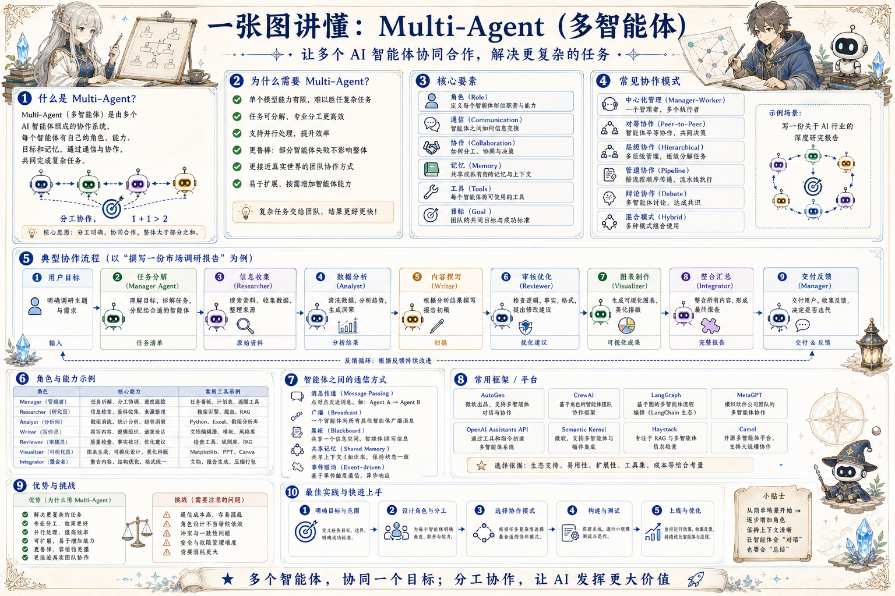

# Multi-Agent 协同地图：多个智能体如何完成复杂任务

> 通过角色分工、通信协议、共享记忆、交接机制和人类监督，让多个 Agent 协作而不是互相干扰。

## 一句话

多智能体不是越多越强，而是分工清楚、协议清楚、边界清楚才会更强。

## 标准流程

1. 目标分解
2. 角色分配
3. 并行执行
4. 消息同步
5. 共享记忆
6. 冲突处理
7. 结果整合
8. 人工验收

## 知识拆解

### 核心定义

- Multi-Agent 是多个智能体协同完成任务
- 每个 Agent 有角色、工具、记忆和能力边界
- 适合任务复杂、可分工、需要并行的场景
- 也会带来通信成本和一致性问题

### 角色分工

- Manager 拆任务和监控进度
- Researcher 搜索资料并记录来源
- Analyst 做数据分析和判断
- Writer / Reviewer 负责生成和质量检查

### 通信协议

- 消息要包含目标、上下文、请求和结果
- 用结构化格式避免自由对话失控
- 重要决策需要原因和证据
- 跨 Agent 交接要有状态摘要

### 共享记忆

- 共享任务事实、约束和中间产物
- 个人偏好和敏感信息不应随意共享
- 写入记忆要记录来源和时间
- 冲突信息需要标注版本和可信度

### 协作模式

- Manager-Worker：集中分配任务
- Peer-to-Peer：平等协作和互审
- Pipeline：按阶段传递产物
- Debate：用多视角讨论高风险判断

### 任务交接

- 交接内容包括输入、产物、未决问题和风险
- 下游 Agent 不应重新猜测上游意图
- 失败交接需要回退到上一阶段
- 状态机能减少交接混乱

### 冲突处理

- 不同 Agent 结论冲突时看证据质量
- 高风险冲突交给 Reviewer 或人工
- 系统要保留分歧，而非强行平均
- 可用投票、仲裁或二次检索解决

### 人类介入

- 目标设定、权限授予和高风险决策需要人类
- 人类反馈应写回任务记忆和规则
- 界面要显示每个 Agent 的贡献和状态
- 不要让用户面对一堆不可解释输出

### 工程落地

- 限制 Agent 数量和轮次，控制成本
- 建立消息日志、trace 和可回放任务记录
- 给每个角色配置最小工具集合
- 用真实任务评估质量、延迟和返工率

## 实践检查清单

- 先证明单 Agent 不够，再引入多 Agent
- 每个角色要有职责、输入、输出和停止条件
- 通信要结构化，不能无限聊天
- 共享记忆需要权限、版本和冲突解决
- 最终交付必须有一个整合者负责一致性

## 维护说明

本文由 `content/notes/ai-knowledge-topics.json` 的结构化内容生成。
如果需要调整正文或海报文字，请先修改数据源，再运行 `python3 scripts/build_knowledge_posters.py`。
