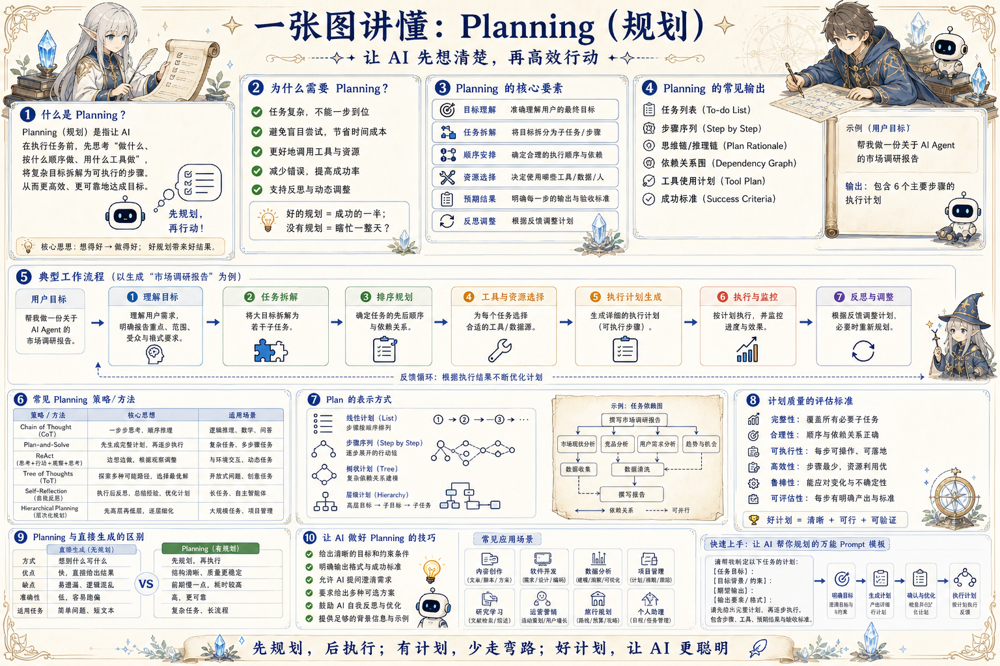

# AI Planning 知识地图：先想清楚，再高效行动

> 把目标、任务、依赖、工具、执行和反思拆开，让 Agent 的行动可解释、可监控、可调整。

## 一句话

好计划不是把步骤写满，而是让目标、约束、依赖和成功标准同时清楚。

## 标准流程

1. 目标澄清
2. 任务拆解
3. 依赖建图
4. 资源选择
5. 计划生成
6. 执行监控
7. 反思修正
8. 交付验证

## 知识拆解

### 核心定义

- Planning 是把目标转成可执行路径
- 它包含拆解、排序、资源匹配和监控
- 适合复杂、多步骤、强约束任务
- 不是所有问题都需要完整计划

### 目标建模

- 明确用户真正想得到的结果
- 分清硬约束、软偏好和默认假设
- 把成功标准写成可检查条件
- 识别不可做、不能碰和需要审批的边界

### 任务拆解

- 把大目标拆成可完成的子任务
- 每个子任务要有输入、输出和完成信号
- 避免拆得过细造成调度成本过高
- 保留可并行、可延期和可跳过的标签

### 依赖排序

- 先做会影响后续判断的任务
- 构建依赖图，避免前置条件缺失
- 识别阻塞点和可替代路径
- 在计划里标出并行执行机会

### 工具计划

- 为每个任务选择最小必要工具
- 工具调用需要参数、权限和超时策略
- 写操作要有确认、回滚或审计
- 对不稳定外部系统预留重试路径

### 执行监控

- 跟踪当前步骤、产物和异常
- 长任务输出中间状态而非沉默等待
- 偏离计划时记录原因和影响范围
- 重要操作保留日志、trace 和任务 ID

### 反思迭代

- 比较计划、执行和结果之间的差异
- 根据新证据调整目标或路径
- 重复失败时缩小问题并请求人工介入
- 把有效经验沉淀为模板或 playbook

### 常见模式

- Plan-and-Execute：先规划再执行
- ReAct：边观察边行动边修正
- Tree of Thoughts：保留多条候选思路
- Hierarchical Planning：目标、阶段、任务分层

### 质量评估

- 完整性：必要步骤是否覆盖
- 可行性：每步是否可执行、可验证
- 鲁棒性：失败分支是否清楚
- 成本：步骤、工具和 token 是否节制

## 实践检查清单

- 先写成功标准，再写执行步骤
- 把未知信息显式标记为待验证
- 工具调用要绑定输入、输出和失败分支
- 长任务按里程碑交付，不要一次性黑箱执行
- 计划执行后必须复盘偏差和新约束

## 维护说明

本文由 `content/notes/ai-knowledge-topics.json` 的结构化内容生成。
如果需要调整正文或海报文字，请先修改数据源，再运行 `python3 scripts/build_knowledge_posters.py`。
