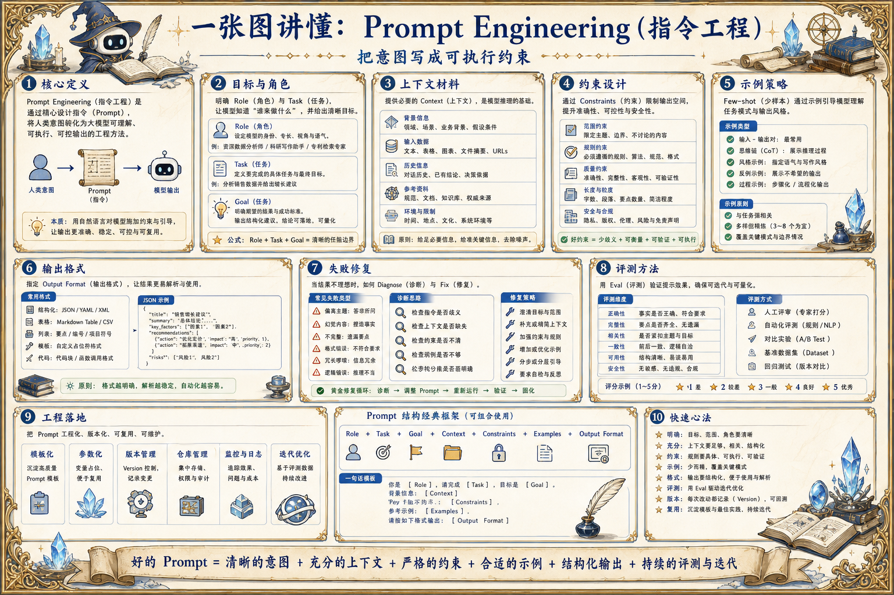

# Prompt Engineering 指令工程地图：把意图写成可执行约束

> Prompt Engineering 通过角色、任务、上下文、示例、输出格式和失败修复，让模型稳定理解目标并产出可用结果。

## 一句话

好的 Prompt 不是把愿望写长，而是把任务、约束、证据、格式和验收标准写清楚。

## 标准流程

1. 明确目标
2. 定义角色
3. 注入上下文
4. 列出约束
5. 给出示例
6. 规定格式
7. 处理失败
8. 评测迭代

## 知识拆解

### 核心定义

- Prompt Engineering 是设计模型输入的工程方法
- 目标是让模型理解任务、边界和输出标准
- 它连接产品意图、上下文和模型能力
- 不是玄学话术，而是可测试的接口设计

### 目标与角色

- 先说明要解决的问题和最终产物
- 角色设定用于限定视角和专业能力
- 避免把多个互相冲突的角色塞进同一指令
- 复杂任务可拆成规划者、执行者、审核者

### 上下文材料

- 只放与任务相关的背景、数据和规则
- 区分事实、假设、偏好和不可违反约束
- 长材料先摘要、过滤、排序再进入 Prompt
- 上下文来源和时间要显式标注

### 约束设计

- 列出必须做、不能做、需要拒答的条件
- 高风险任务加入权限、人审和审计要求
- 数值、日期、单位和字段命名要写清
- 把不确定性输出规则写进指令

### 示例策略

- Zero-shot 适合简单明确任务
- Few-shot 适合格式和风格稳定的任务
- 反例可帮助模型避开常见错误
- 示例要短、真实、覆盖边界情况

### 输出格式

- 面向系统消费时优先 JSON / 表格 / 固定字段
- 字段要有类型、含义和是否必填
- 自然语言解释和结构化结果分区输出
- 格式错误要可检测、可重试、可修复

### 失败修复

- 识别失败来自缺信息、误解任务还是格式不稳
- 对常见错误写入检查清单
- 必要时让模型先列假设再回答
- 连续失败要缩小任务或引入工具验证

### 评测方法

- 用真实样本集比较不同 Prompt 版本
- 指标包括正确率、格式通过率、拒答率和成本
- 抽样人工评审语义质量和风险
- 失败样本进入下一版 Prompt 回归集

### 工程落地

- Prompt 作为版本化配置管理
- 不同任务使用可复用模板和变量注入
- 与 Context、Tool、Guardrails 联动
- 上线后记录输入、输出、版本和评分

## 实践检查清单

- 先写任务目标和成功标准，再补背景材料
- 把必须遵守的约束放在清晰位置
- 输出格式要机器可解析，并给出字段含义
- few-shot 示例必须贴近真实任务，而不是装饰
- Prompt 变更要进入版本、回归和线上观察

## 维护说明

本文由 `content/notes/ai-knowledge-topics.json` 的结构化内容生成。
如果需要调整正文或海报文字，请先修改数据源，再运行 `python3 scripts/build_knowledge_posters.py`。
如果只想更新单个主题，可以在命令后追加 slug，例如 `python3 scripts/build_knowledge_posters.py agent-harness`。
脚本默认不会覆盖已存在的海报；如需生成程序化草稿图，请显式追加 `--overwrite-posters`。
