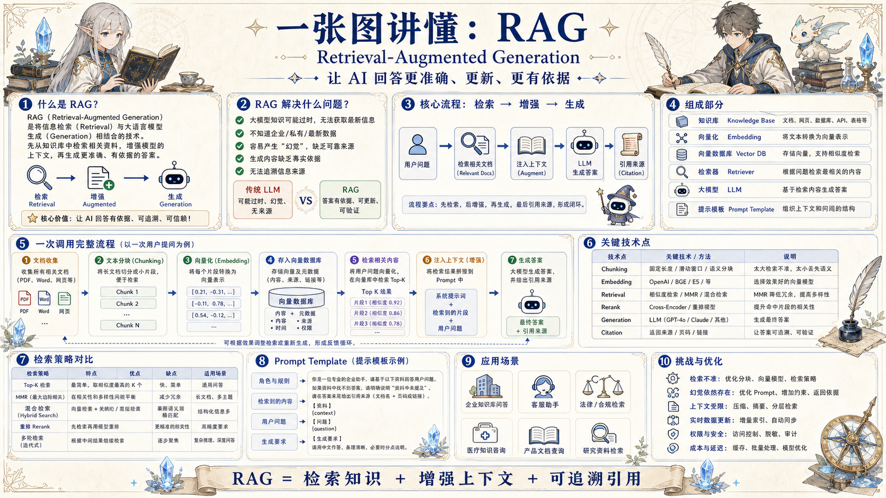

# RAG 知识地图：让模型带着证据回答

> 从外部知识、检索排序、上下文拼装到引用验证，构建可追溯、可更新的问答系统。

## 一句话

RAG 的核心不是把资料塞给模型，而是把可信证据在正确时机放进上下文。

## 标准流程

1. 资料采集
2. 清洗切分
3. 向量化
4. 召回检索
5. 重排过滤
6. 上下文拼装
7. 生成引用
8. 评估迭代

## 知识拆解

### 核心定义

- Retrieval：先从知识库找相关证据
- Augmented：把证据压缩进模型上下文
- Generation：基于证据生成答案与引用
- 适合知识常变、私有数据多、需要可追溯的场景

### 知识源设计

- 文档、网页、表格、数据库和业务日志都可入库
- 每条资料保留 owner、更新时间、权限和来源链接
- 先清洗噪声，再抽取结构化元数据
- 避免把未审核资料直接混入生产知识库

### Chunk 策略

- 按标题、段落、表格、FAQ、代码块等语义单元切分
- Chunk 太小会丢上下文，太大会稀释相似度
- 保留父级标题、路径、时间和业务标签
- 重要长文可做父子 Chunk 或摘要索引

### Embedding 与索引

- Embedding 把文本转成可相似度搜索的向量
- 向量库负责近邻召回，元数据过滤负责缩小范围
- 模型、维度、语种和更新频率会影响成本
- 索引变更需要重建计划和兼容策略

### 检索与重排

- 关键词检索适合精确词，向量检索适合语义相近
- Hybrid Search 可兼顾术语和语义
- Rerank 用更强模型重新排序候选证据
- 过滤低置信、重复、越权和过期内容

### 上下文拼装

- 按任务目标组织证据，不是简单堆材料
- 控制 token 预算，优先放高相关和高可信内容
- 加入来源、限制条件、输出格式和拒答规则
- 长任务可分阶段检索与生成

### 答案与引用

- 每个关键结论尽量绑定证据片段
- 引用要能定位到文档、页码、URL 或记录 ID
- 证据不足时输出不确定性，而不是补故事
- 生成后可做事实一致性复核

### 评估指标

- Recall@K：相关证据是否被召回
- Faithfulness：答案是否忠于证据
- Citation Accuracy：引用是否支持对应结论
- Latency / Cost：检索、重排、生成的综合成本

### 工程落地

- 建立增量同步、失败重试和索引版本管理
- 对不同用户做权限裁剪和审计日志
- 高风险答案进入人工复核或二次验证
- 持续收集未命中问题来优化知识库

## 实践检查清单

- 资料来源、版本、权限必须可追踪
- Chunk 要按语义边界切分，保留标题和来源
- 检索结果需要重排、去重、过期过滤
- 答案必须能回指证据，不能把猜测伪装成事实
- 评估要覆盖命中率、引用正确率和幻觉率

## 维护说明

本文由 `content/notes/ai-knowledge-topics.json` 的结构化内容生成。
如果需要调整正文或海报文字，请先修改数据源，再运行 `python3 scripts/build_knowledge_posters.py`。
