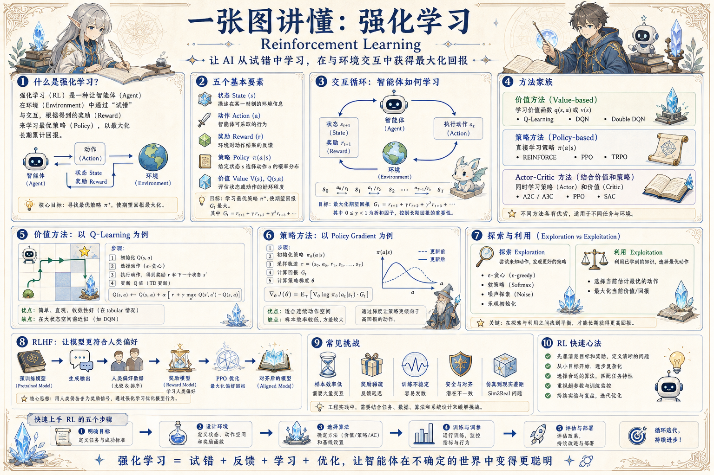

# 强化学习知识地图：从试错到策略优化

> 用状态、动作、奖励和策略解释智能体如何在反馈循环中学习长期收益。

## 一句话

强化学习关注的不是一次回答对不对，而是一连串行动能否带来更好的长期回报。

## 标准流程

1. 观察状态
2. 选择动作
3. 环境反馈
4. 获得奖励
5. 更新价值
6. 优化策略
7. 继续探索
8. 收敛评估

## 知识拆解

### 核心定义

- Agent 在环境中行动并接收反馈
- State 描述当前局面，Action 是可执行选择
- Reward 衡量一步反馈，Return 衡量长期收益
- Policy 决定在状态下如何选动作

### 五个要素

- 状态空间：模型能观察到什么
- 动作空间：系统允许做什么
- 奖励函数：什么行为被鼓励
- 策略模型：如何从观察映射到动作

### 价值方法

- Value 估计一个状态未来好不好
- Q-value 估计某状态下某动作的价值
- Q-learning 用 TD 误差逐步修正估计
- 适合动作空间有限、反馈可模拟的任务

### 策略方法

- 直接优化策略参数，而不是先估值
- Policy Gradient 适合连续或复杂动作空间
- REINFORCE 用采样轨迹估计梯度
- 方差较高，需要 baseline 和稳定技巧

### Actor-Critic

- Actor 负责选择动作
- Critic 负责评价动作和状态
- 两者结合能降低方差并提升样本效率
- A2C、A3C、PPO、SAC 都可视为该家族

### 探索机制

- Epsilon-greedy 随机尝试部分动作
- Entropy bonus 鼓励策略保持多样性
- UCB / Thompson 关注不确定性
- 探索不足会局部最优，探索过多会训练不稳

### RLHF 视角

- 先收集人类偏好样本
- 训练 Reward Model 表达人类偏好
- 用 PPO 等方法优化生成模型策略
- 再通过评估和红队控制安全风险

### 风险与挑战

- 样本效率低，真实环境试错成本高
- 奖励设计偏差会导致投机行为
- 训练不稳定，容易对环境过拟合
- 安全约束必须在训练和部署两端存在

### 工程落地

- 先用模拟器和离线日志验证可行性
- 把奖励、状态和动作全部记录为 trace
- 高风险动作需要人工审批或沙盒执行
- 上线后监控策略漂移和异常收益

## 实践检查清单

- 奖励函数决定学习方向，必须防止奖励黑客
- 探索与利用要平衡，不能只贪眼前收益
- 训练曲线要看长期回报、稳定性和方差
- 离线数据、模拟环境和安全边界要先设计
- RLHF 需要区分奖励模型、偏好数据和策略优化

## 维护说明

本文由 `content/notes/ai-knowledge-topics.json` 的结构化内容生成。
如果需要调整正文或海报文字，请先修改数据源，再运行 `python3 scripts/build_knowledge_posters.py`。
