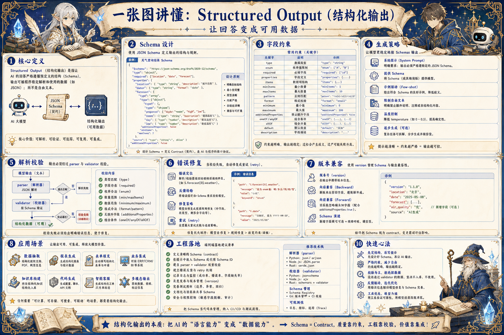

# Structured Output 结构化输出地图：让回答变成可用数据

> 结构化输出通过 JSON Schema、字段约束、解析校验、自动修复和回归测试，让模型结果稳定进入业务系统。

## 一句话

结构化输出的目标不是让模型看起来整齐，而是让下游系统敢解析、敢落库、敢自动执行。

## 标准流程

1. 定义任务
2. 设计 Schema
3. 约束字段
4. 生成结果
5. 解析校验
6. 自动修复
7. 写入系统
8. 回归监控

## 知识拆解

### 核心定义

- Structured Output 是模型和系统之间的输出契约
- 它把自然语言结果转成机器可解析数据
- 适合抽取、分类、计划、报告和工作流节点
- 重点是可校验、可修复、可演进

### Schema 设计

- 用 object、array、string、number、boolean 表达结构
- 字段名使用稳定、明确、可读的业务词
- 必填字段和可选字段分开定义
- 嵌套层级不宜过深，避免模型遗漏

### 字段约束

- 枚举值限制类别和状态
- 数字字段写明单位、范围和精度
- 日期字段统一格式和时区
- 文本字段区分摘要、理由、证据和备注

### 生成策略

- 在 Prompt 中给出 Schema 和字段解释
- 要求只输出 JSON 时避免混入解释文本
- 复杂结果可先生成草稿再结构化
- 长列表任务要控制数量和排序规则

### 解析校验

- 先做 JSON parse，再做 Schema validate
- 校验类型、必填、枚举、范围和引用完整性
- 校验错误要返回模型修复上下文
- 下游写入前再做业务规则校验

### 错误修复

- 格式错误可让模型只修复 JSON
- 缺字段时补充缺失信息或返回 unknown
- 语义冲突要重新检索或请求用户确认
- 多次失败后进入人工处理或安全降级

### 版本兼容

- Schema 版本要随 Prompt 和代码一起发布
- 新增字段优先可选，删除字段需迁移
- 保留旧版本解析器处理历史数据
- 评测集覆盖新旧 Schema 样本

### 应用场景

- 信息抽取、表单填写和标签分类
- Agent 计划、工具参数和任务状态
- 报告大纲、审核意见和风险分级
- 把非结构化内容进入数据库或工作流

### 工程落地

- 定义统一输出契约和错误码
- 解析器、校验器和修复器独立模块化
- 记录原始输出、修复输出和校验结果
- 把格式通过率作为发布门禁

## 实践检查清单

- Schema 字段必须对应真实业务含义
- 枚举、范围、必填项和默认值要明确
- 解析失败不能静默吞掉，必须重试或转人工
- 版本升级要兼容旧数据和旧调用方
- 高风险字段进入规则校验和审计

## 维护说明

本文由 `content/notes/ai-knowledge-topics.json` 的结构化内容生成。
如果需要调整正文或海报文字，请先修改数据源，再运行 `python3 scripts/build_knowledge_posters.py`。
如果只想更新单个主题，可以在命令后追加 slug，例如 `python3 scripts/build_knowledge_posters.py agent-harness`。
脚本默认不会覆盖已存在的海报；如需生成程序化草稿图，请显式追加 `--overwrite-posters`。
