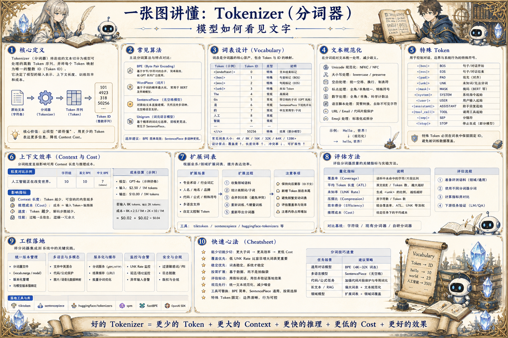

# Tokenizer 分词器地图：模型如何看见文字

> Tokenizer 把文本切成 token 并映射到 ID，影响上下文效率、多语言、代码、数字、成本和训练推理一致性。

## 一句话

Tokenizer 是模型看世界的字典；切得好不好，会影响成本、长度、语义边界和训练效果。

## 标准流程

1. 收集语料
2. 规范化文本
3. 训练词表
4. 切分 Token
5. 映射 ID
6. 加入特殊符
7. 训练推理
8. 版本维护

## 知识拆解

### 核心定义

- Tokenizer 把文本转换成模型可处理的 token ID
- 模型并不直接读取字符或单词
- 分词方式影响上下文长度和成本
- 训练和推理必须使用同一个 tokenizer

### 常见算法

- BPE 通过频繁合并子词构建词表
- WordPiece 常用于部分语言模型
- SentencePiece 可直接处理原始文本
- Unigram 根据概率选择子词分解

### 词表设计

- 词表太小会导致文本被切得很碎
- 词表太大增加 embedding 参数和稀疏性
- 领域词、代码符号和多语言字符要覆盖
- 特殊 token 需要保留固定 ID

### 文本规范化

- 大小写、空格、标点和 Unicode 归一化影响切分
- 中文、英文、数字和代码有不同特征
- 不一致的预处理会造成训练推理偏差
- 规范化规则要版本化

### 特殊 Token

- BOS/EOS 标记序列开始和结束
- 对话模板需要 user、assistant、system 标记
- 工具调用和结构化输出可用专用边界符
- 多模态模型需要 image/audio 等占位符

### 上下文效率

- 同一句话在不同 tokenizer 下 token 数可能差很多
- token 数直接影响上下文容量和推理成本
- 代码、表格和中文压缩效率要单独评估
- 长上下文应用尤其关注 token 膨胀

### 扩展词表

- 新增 token 需要扩展 embedding 矩阵
- 常见于领域词、工具标记和特殊格式
- 需要训练让新 token 获得合理表示
- 随意扩展可能破坏兼容性

### 评估方法

- 看压缩率、OOV 表现和任务质量
- 比较不同语种和领域语料 token 数
- 测试特殊格式和边界符稳定性
- 关注训练速度、显存和下游效果

### 工程落地

- 模型发布必须同时发布 tokenizer 文件
- 网关、训练、推理和评测使用同一版本
- Prompt 模板要按 tokenizer 计算预算
- Tokenizer 变更视为破坏性版本升级

## 实践检查清单

- Tokenizer 必须和模型权重严格匹配
- 多语言和代码场景要看 token 压缩效率
- 特殊 token 设计影响对话、工具和多模态格式
- 词表扩展需要重新训练或适配 embedding
- 评估不能只看词表大小，也要看任务成本和质量

## 维护说明

本文由 `content/notes/ai-knowledge-topics.json` 的结构化内容生成。
如果需要调整正文或海报文字，请先修改数据源，再运行 `python3 scripts/build_knowledge_posters.py`。
如果只想更新单个主题，可以在命令后追加 slug，例如 `python3 scripts/build_knowledge_posters.py agent-harness`。
脚本默认不会覆盖已存在的海报；如需生成程序化草稿图，请显式追加 `--overwrite-posters`。
