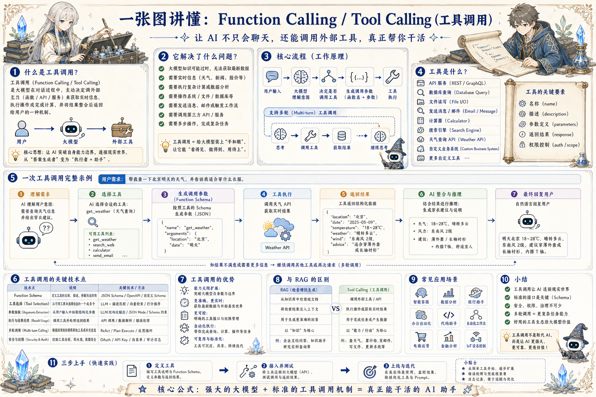

# Tool Calling 工具调用地图：让模型从回答变成行动

> 通过 Schema、工具选择、参数生成、执行校验和权限控制，让 Agent 安全调用外部系统。

## 一句话

工具调用把模型从“会说”推进到“会做”，但每一次行动都要有边界、证据和审计。

## 标准流程

1. 理解意图
2. 选择工具
3. 生成参数
4. 校验权限
5. 执行调用
6. 解析结果
7. 错误恢复
8. 回复或写回

## 知识拆解

### 核心定义

- Tool Calling 让模型按结构化协议调用外部能力
- 工具可以是 API、数据库、文件、脚本或业务系统
- 模型负责选择工具和生成参数
- 系统负责执行、校验和返回结果

### 工具描述

- 名称要稳定、语义清楚
- 描述说明适用场景和限制
- 参数字段要包含类型、含义和必填规则
- 返回值结构要便于模型继续推理

### 参数 Schema

- 用 JSON Schema 或等价结构约束输入
- 枚举、范围、格式和默认值要明确
- 复杂对象拆成可验证字段
- 避免把关键参数塞进一段自然语言

### 工具选择

- 模型根据用户意图和工具说明决定是否调用
- 多工具场景需要路由或规划
- 相似工具要区分边界，避免误选
- 不需要实时信息时不要过度调用工具

### 执行与结果

- 执行层处理鉴权、网络、超时和重试
- 结果要保留原始字段和状态码
- 模型只解释结果，不应伪造未返回的信息
- 写入结果要回传资源 ID 或任务 ID

### 错误恢复

- 参数错误时请求补全或自动修正
- 网络失败时按策略重试
- 权限不足时给出可执行的下一步
- 不可恢复错误要停止而非继续扩散

### 安全边界

- 读写权限分开配置
- 高风险写操作需要确认或审批
- 敏感参数脱敏记录
- 工具输出不能绕过系统规则

### 可观测性

- 记录 tool name、arguments、result、duration
- 长任务返回 job id 并轮询进度
- 把工具调用串进完整 trace
- 失败样本进入评估和回归测试

### 工程落地

- 从少量高价值工具开始接入
- 为 Agent 暴露机器可读工具清单
- 用 mock 和回放测试参数生成质量
- 把工具调用策略写进系统提示和运行规范

## 实践检查清单

- 工具描述要清楚说明何时用、怎么用、不能做什么
- Schema 要尽量结构化，避免自由文本参数滥用
- 写操作前必须检查权限、幂等和确认机制
- 工具失败要返回可诊断错误，而不是让模型猜
- 所有调用都要记录参数、结果、耗时和 trace

## 维护说明

本文由 `content/notes/ai-knowledge-topics.json` 的结构化内容生成。
如果需要调整正文或海报文字，请先修改数据源，再运行 `python3 scripts/build_knowledge_posters.py`。
