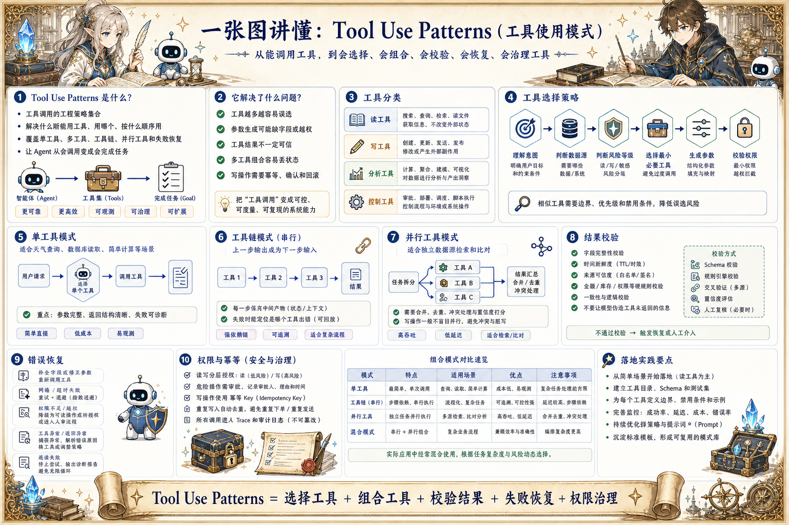

# Tool Use Patterns 工具使用地图：从会调用到会用好

> 在 Tool Calling 之上，设计工具选择、组合、并行、校验、重试、幂等和权限，让 Agent 更稳地完成真实任务。

## 一句话

Tool Calling 解决能不能调用工具，Tool Use Patterns 解决什么时候、以什么顺序、在什么边界内使用工具。

## 标准流程

1. 识别意图
2. 选择工具
3. 规划参数
4. 执行调用
5. 验证结果
6. 组合下一步
7. 处理失败
8. 写回状态

## 知识拆解

### 核心定义

- Tool Use Patterns 是工具调用的工程策略集合
- 目标是让 Agent 不只是能调用，而是会选择、会组合、会校验
- 它覆盖单工具、多工具、工具链和工具失败处理
- 适合接入真实业务系统的 Agent 产品

### 工具分类

- 读工具：搜索、查询、检索、读取文件
- 写工具：创建订单、更新状态、发送消息
- 分析工具：计算、聚合、建模、可视化
- 控制工具：审批、部署、调度、执行脚本

### 选择策略

- 按用户意图、数据来源和风险等级选择工具
- 相似工具需要明确边界和优先级
- 可以用路由器先判断领域和能力
- 无法确定时应澄清或选择低风险只读工具

### 单工具模式

- 适合天气查询、数据库读取、简单计算
- 重点是参数完整、返回结构清晰
- 模型回复要引用工具结果
- 工具失败时给出具体补救动作

### 工具链模式

- 多个工具按顺序处理同一任务
- 前一步输出成为后一步输入
- 每一步都要保存中间产物
- 链路失败时能定位是哪一个工具出错

### 并行工具

- 适合独立数据源的并行检索和比对
- 可以降低延迟并提升覆盖率
- 需要合并、去重和冲突处理
- 写操作一般不应盲目并行

### 结果校验

- 校验字段完整性、时间新鲜度和来源可信度
- 对数值、金额、库存和权限做硬规则检查
- 多来源结果冲突时要保留证据
- 不要让模型补全工具没有返回的事实

### 错误恢复

- 参数错误可自动修正或请求补充
- 暂时失败可重试并退避
- 权限错误要转人审或引导授权
- 连续失败应停止并输出诊断摘要

### 权限与幂等

- 读写工具分层授权
- 危险动作需要确认、审批或沙盒
- 写操作必须支持幂等 key 和回滚记录
- 所有工具调用纳入审计日志和 eval 样本

## 实践检查清单

- 工具越多越需要路由、优先级和禁用条件
- 每个工具都要有清楚的成功结果和失败结果
- 并行调用适合独立读操作，不适合有顺序依赖的写操作
- 工具链要保存中间结果，便于回放和排错
- 写工具必须设计幂等、确认、审计和回滚

## 维护说明

本文由 `content/notes/ai-knowledge-topics.json` 的结构化内容生成。
如果需要调整正文或海报文字，请先修改数据源，再运行 `python3 scripts/build_knowledge_posters.py`。
如果只想更新单个主题，可以在命令后追加 slug，例如 `python3 scripts/build_knowledge_posters.py agent-harness`。
脚本默认不会覆盖已存在的海报；如需生成程序化草稿图，请显式追加 `--overwrite-posters`。
