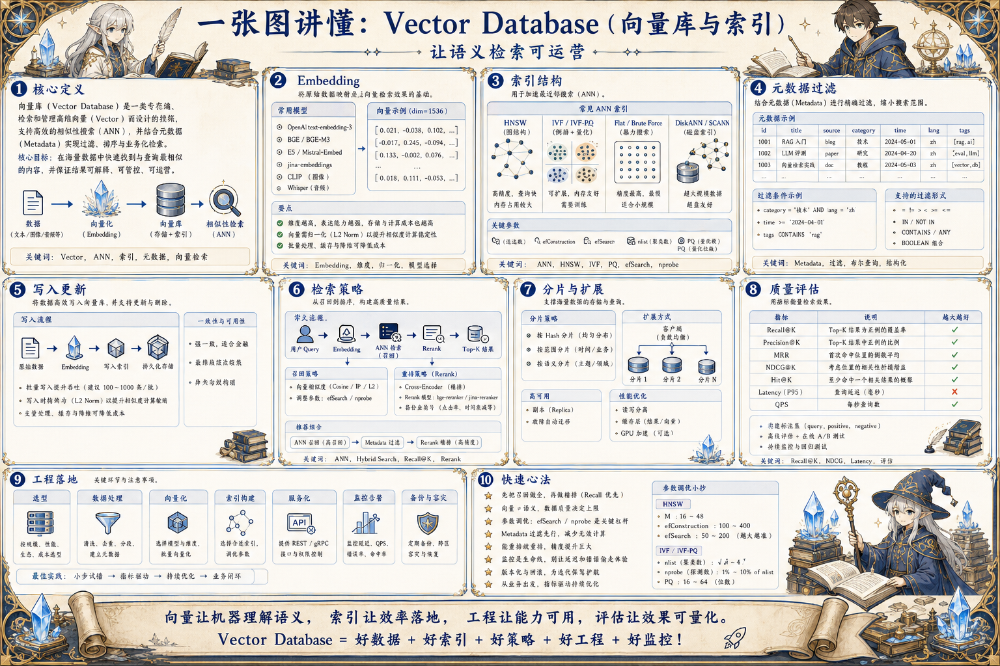

# Vector Database 向量库地图：让语义检索可运营

> 向量数据库通过 Embedding、索引、元数据过滤、增量更新、混合检索和权限控制，支撑 RAG 与语义搜索系统。

## 一句话

向量库不是神奇记忆，而是一套需要索引、过滤、版本、权限和评测持续维护的检索系统。

## 标准流程

1. 生成向量
2. 写入文档
3. 构建索引
4. 元数据过滤
5. 相似召回
6. 混合检索
7. 结果重排
8. 监控更新

## 知识拆解

### 核心定义

- 向量数据库存储文本、图片或实体的向量表示
- 通过近似最近邻搜索召回语义相近内容
- 常用于 RAG、推荐、去重和语义搜索
- 它需要和元数据、权限、评测一起设计

### Embedding

- Embedding 把内容映射到向量空间
- 模型选择影响语种、领域和相似度表现
- 维度越高不一定越好，成本和存储也会上升
- Embedding 版本升级通常需要重建索引

### 索引结构

- HNSW 常用于高召回低延迟场景
- IVF / PQ 适合大规模压缩和分桶
- Flat 精确但成本高
- 索引参数需要在召回、延迟和内存间权衡

### 元数据过滤

- 记录来源、时间、权限、业务标签和版本
- 过滤先缩小候选范围再做语义召回
- 权限过滤必须在服务端强制执行
- 元数据缺失会让检索结果难以解释

### 写入更新

- 文档切分后写入 chunk、向量和元数据
- 增量同步要处理新增、更新、删除和过期
- 批量导入需要幂等 key 和失败重试
- 重建索引时保持版本可切换

### 检索策略

- TopK 不是越大越好，需要后续重排和压缩
- Hybrid Search 结合关键词和向量
- 按业务场景选择相似度阈值
- 多查询扩展能提高覆盖但增加噪声

### 分片与扩展

- 按租户、语种、业务线或时间做集合拆分
- 冷热数据分层减少成本
- 高并发场景要关注连接池和批量查询
- 跨分片结果需要合并和重排

### 质量评估

- 评估 Recall@K、MRR、NDCG 和点击反馈
- 构造同义词、长问题、实体歧义样本
- 检查低质量 chunk 和过期资料
- 线上零结果和低置信查询要回流

### 工程落地

- 向量库选型看规模、过滤、运维和生态
- 把索引版本、Embedding 版本和数据版本绑定
- 监控延迟、召回、存储和同步失败
- 与 RAG Eval 和权限系统联动

## 实践检查清单

- Embedding 模型、维度和距离度量要固定版本
- 元数据设计决定权限、过滤和可运营能力
- 索引参数影响召回率、延迟和内存
- 增量更新要处理删除、过期和重建
- 检索质量必须用真实查询评测

## 维护说明

本文由 `content/notes/ai-knowledge-topics.json` 的结构化内容生成。
如果需要调整正文或海报文字，请先修改数据源，再运行 `python3 scripts/build_knowledge_posters.py`。
如果只想更新单个主题，可以在命令后追加 slug，例如 `python3 scripts/build_knowledge_posters.py agent-harness`。
脚本默认不会覆盖已存在的海报；如需生成程序化草稿图，请显式追加 `--overwrite-posters`。
