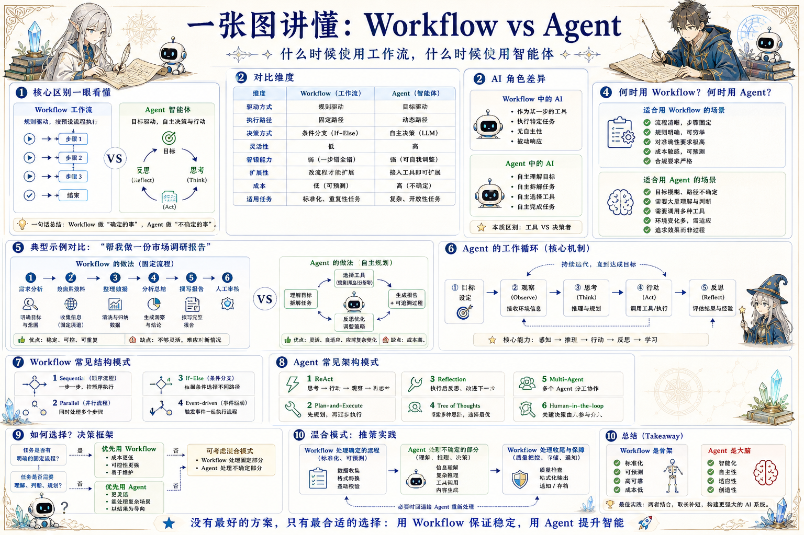

# Workflow 与 Agent 决策地图：流程稳定，智能补位

> 区分确定性工作流和自主智能体，在可控成本与灵活处理之间找到工程平衡。

## 一句话

Workflow 负责稳定可控，Agent 负责处理不确定；真正可用的系统往往是二者协作。

## 标准流程

1. 任务识别
2. 确定性判断
3. 流程执行
4. Agent 补位
5. 质量检查
6. 人审介入
7. 状态写回
8. 持续优化

## 知识拆解

### 核心区别

- Workflow 是预设路径驱动
- Agent 是目标和观察驱动
- Workflow 强在稳定、可预测、低成本
- Agent 强在理解、规划和适应变化

### Workflow 适用

- 流程清晰、规则固定、输入标准化
- 成本需要可预测，结果需要高一致性
- 合规、审批、财务和发布链路更适合流程
- 失败分支可以提前枚举

### Agent 适用

- 任务目标明确但路径不确定
- 需要阅读、判断、搜索、比较和规划
- 外部信息变化快，无法全部写成规则
- 需要多个工具协同完成任务

### 控制面

- Workflow 控制步骤和状态机
- Agent 控制推理、选择和执行策略
- 系统要给 Agent 明确工具边界
- 关键写操作必须留审计和幂等保护

### 可观测性

- Workflow 记录节点、状态和耗时
- Agent 记录目标、上下文、工具调用和理由
- 长任务需要 progress、log 和 trace
- 异常要能定位到输入、步骤和模型响应

### 风险边界

- Agent 可能误解目标或越权操作
- Workflow 可能僵硬，难以处理边缘情况
- 写操作要区分草稿、建议和正式提交
- 高风险结果进入人工审核

### 混合模式

- Workflow 编排稳定阶段
- Agent 处理不确定的理解和生成
- QA 节点把 Agent 输出拉回规则边界
- 状态机负责最终流转与回滚

### 产品设计

- 用户应看到当前阶段、下一步和异常原因
- 不要把 Agent 决策藏成黑箱
- 提供人工接管和重跑入口
- 成功经验沉淀成可复用模板

### 评估方法

- 比较准确率、完成率、成本和延迟
- 统计人工介入率与返工率
- 记录 Agent 决策与最终结果差异
- 用真实任务回放验证系统鲁棒性

## 实践检查清单

- 有固定步骤和强合规要求时优先 Workflow
- 目标模糊、信息不完整、路径变化大时考虑 Agent
- Agent 写状态前要有权限、审计和回滚设计
- 混合模式里 Workflow 要负责边界和最终一致性
- 不要让 Agent 随意跳过业务规则

## 维护说明

本文由 `content/notes/ai-knowledge-topics.json` 的结构化内容生成。
如果需要调整正文或海报文字，请先修改数据源，再运行 `python3 scripts/build_knowledge_posters.py`。
